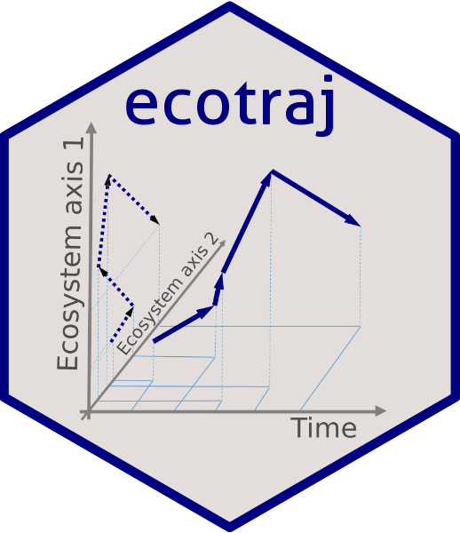

```{r setup, echo = FALSE}
knitr::opts_chunk$set(collapse = TRUE, comment = "#>", fig.path = "README-")
```


# Ecological trajectory analysis <a href="https://emf-creaf.github.io/ecotraj/"></a>

  [](https://cran.r-project.org/package=ecotraj)
  [](https://cran.rstudio.com/web/packages/ecotraj/index.html)
[](https://github.com/emf-creaf/ecotraj/actions)

## Introduction

Package `ecotraj` is a package providing Ecological Trajectory Analysis (ETA), a framework to assist ecologists in the analysis of temporal changes in ecosystems defined on a chosen multivariate space. 

ETA is related to the following publications:

* First presentation of the community trajectory analysis framework (De Cáceres et al. 2019).

* Extension of community trajectory analysis (Sturbois et al. 2021a). 

* Generalization to stable isotope data (Sturbois et al. 2021b).

* Application of ETA framework for the assessment of ecological quality (Sturbois et al. 2023).

## Package installation and documentation

Package `ecotraj` can be found at [CRAN](https://cran.r-project.org/package=ecotraj). In addition, the latest stable `ecotraj` R package can also be installed from GitHub as follows:

```{r installation, eval = FALSE}
remotes::install_github("emf-creaf/ecotraj")
```

Although the package comes with function documentation, articles explaining how to use the package can be found at https://emf-creaf.github.io/ecotraj/.

## Related package

The R package [**ecoregime**](https://mspinillos.github.io/ecoregime/), by Martina Sánchez-Pinillos, implements the Ecological Dynamic Regimes (EDR) framework to characterize and compare groups of ecological trajectories in multidimensional spaces defined by ecosystem state variables.

## References

+ De Cáceres, M., Coll, L., Legendre, P., Allen, R.B., Wiser, S.K., Fortin, M.J., Condit, R. & Hubbell, S. (2019). Trajectory analysis in community ecology. Ecological Monographs 89, e01350 (https://doi.org/10.1002/ecm.1350).

+ Sturbois, A., De Cáceres, M., Sánchez-Pinillos, M., Schaal, G., Gauthier, O., Le Mao, P., Ponsero, A., & Desroy, N. (2021a). Extending community trajectory analysis : New metrics and representation. Ecological Modelling, 440, 109400 (https://doi.org/10.1016/j.ecolmodel.2020.109400).

+ Sturbois, A., Cucherousset, J., De Cáceres, M., Desroy, N., Riera, P., Carpentier, A., Quillien, N., Grall,
J., Espinasse, B., Cherel, Y., Schaal, G. (2021). Stable Isotope Trajectory Analysis (SITA) : A new approach to quantify and visualize dynamics in stable isotope studies. Ecological Monographs, 92, e1501  (https://doi.org/10.1002/ecm.1501). 

+ Sturbois, A., De Cáceres, M., Bifolchi, A., Bioret, F., Boyé, A., Gauthier, O., Grall, J., Grémare, A., Labrune, C., Robert, A., Schaal, G., Desroy, N. (2023). Ecological Quality Assessment: a general multivariate framework to report the quality of ecosystems and their dynamics with respect to reference conditions. Ecosphere 14, e4726 (https://doi.org/10.1002/ecs2.4726).
