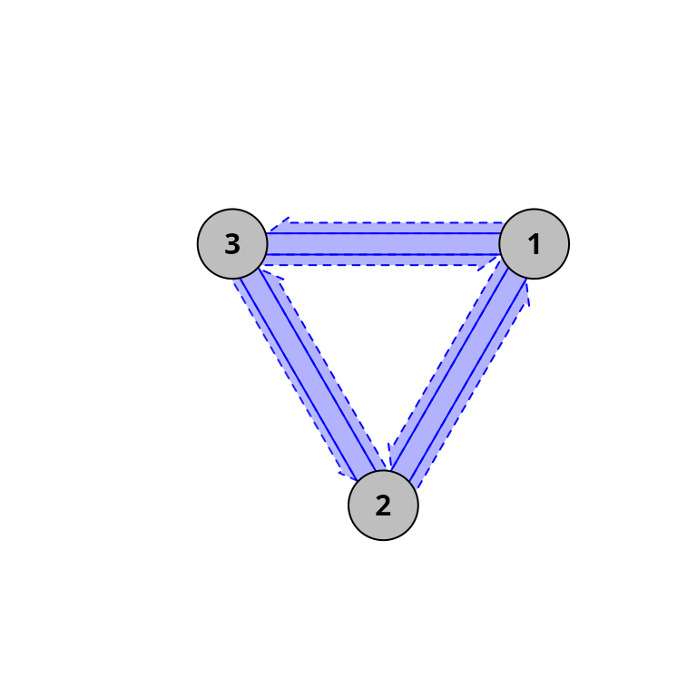
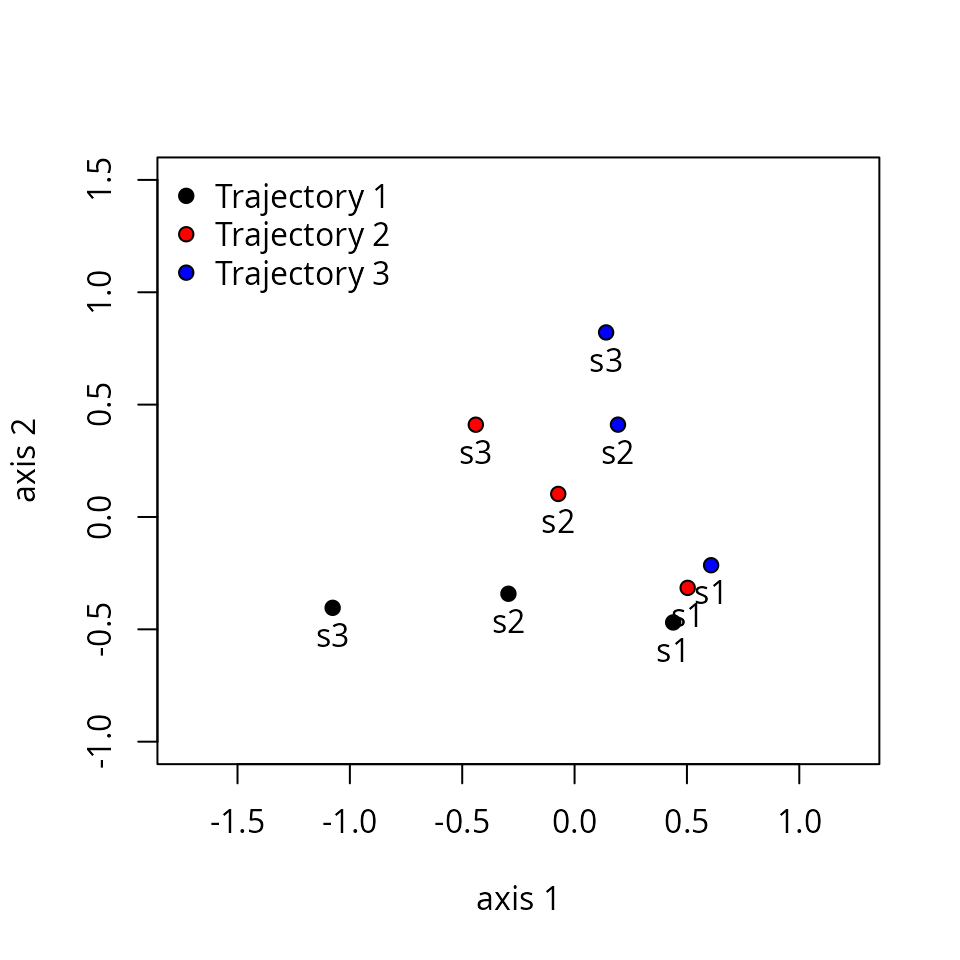
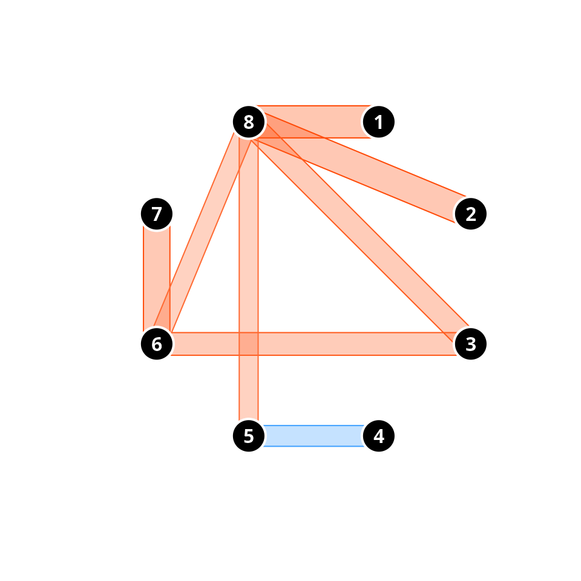
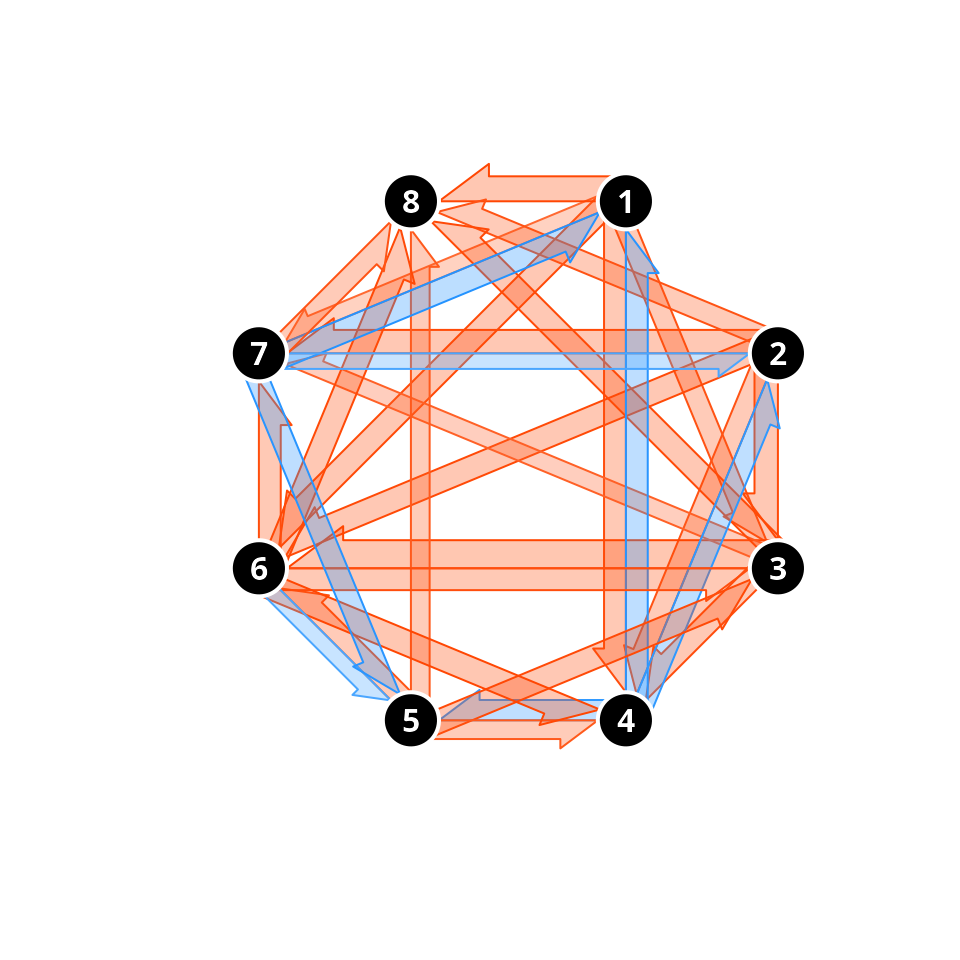

# Introduction to Ecological Trajectory Analysis (ETA)

## 1. Introduction

### 1.1 What is Ecological Trajectory Analysis?

*Ecological Trajectory Analysis* (ETA) is a framework to analyze the
dynamics (i.e. changes through time) of ecological entities
(e.g. individuals, communities or ecosystems). The key aspect of ETA is
that dynamics are represented using trajectories in a chosen
multivariate space noted using $`\Omega`$. These trajectories are
characterized and compared using their geometry in $`\Omega`$.

The ETA framework was presented for community ecology in De Cáceres et
al (2019), and was extended with new metrics and visualisation modes in
Sturbois et al. (2021a). Procedures of trajectory analysis can be
applied to data beyond community data tables. For example, the same
framework was applied to stable isotope data in Sturbois et al. (2021b).

Since it can be applied to multiple target entities and multivariate
spaces, we now refer to the framework as *Ecological Trajectory
Analysis* and provide a package **ecotraj** that offers a set of
functions to calculate metrics and produce plots.

### 1.2 About this vignette

In this vignette you will learn how to conduct ETA using different
package functions. In most of the vignette we describe how to study the
trajectories of three target entities (i.e. sites, individuals,
communities, etc.) that have been surveyed four times each. We use a
small data set where trajectories occur in a space of two dimensions, so
that geometric calculations can be followed more easily. In the last
section a real example is presented.

First of all, we load `ecotraj`:

``` r
library(ecotraj)
```

    ## Loading required package: Rcpp

## 2. Trajectory objects

### 2.1 Trajectory data

#### 2.1.1 Trajectory data items

To specify dynamics of a set of target entities, the following data
items need to be distinguished:

1.  A set of ecological states (i.e. coordinates in space $`\Omega`$)
    implicitly described using a **distance matrix** $`\mathrm{D}`$.
2.  A *character vector* specifying the **ecological entity**
    (i.e. sampling unit, community, ecosystem or individual)
    corresponding to each ecological state. Trajectory names are
    identified from unique values of entities.
3.  An *integer vector* specifying the **survey order** (i.e. first
    census, second census, etc.) corresponding to the observation of
    each ecological state. This vector is important as it specifies the
    temporal order of observations. If not provided, the order will be
    assumed to be incremental for each repetition of entity value.
4.  A *numeric vector* specifying the **survey time**, i.e. the time of
    observation of each ecological state. This is needed for some
    metrics that require explicit time units, such as trajectory speed.
    If not provided, survey times are assumed equal to survey order.

Generally speaking, in ETA target entities do not need to be surveyed
synchronously nor the same number of times, but synchronicity of
observations is required for some metrics.

#### 2.1.2 Example data set

Let us first define the vectors that describe the ecological entity and
the survey order of each observation:

``` r
entities <- c("1","1","1","1","2","2","2","2","3","3","3","3")
surveys <- c(1,2,3,4,1,2,3,4,1,2,3,4)
```

We then define a matrix whose coordinates correspond to the set of
ecological states observed. The number of rows in this matrix has to be
equal to the length of vectors `entities` and `surveys`. For simplicity,
we assume here that the ecological state space $`\Omega`$ has two
dimensions:

``` r
xy<-matrix(0, nrow=12, ncol=2)
xy[2,2]<-1
xy[3,2]<-2
xy[4,2]<-3
xy[5:6,2] <- xy[1:2,2]
xy[7,2]<-1.5
xy[8,2]<-2.0
xy[5:6,1] <- 0.25
xy[7,1]<-0.5
xy[8,1]<-1.0
xy[9:10,1] <- xy[5:6,1]+0.25
xy[11,1] <- 1.0
xy[12,1] <-1.5
xy[9:10,2] <- xy[5:6,2]
xy[11:12,2]<-c(1.25,1.0)
xy
```

    ##       [,1] [,2]
    ##  [1,] 0.00 0.00
    ##  [2,] 0.00 1.00
    ##  [3,] 0.00 2.00
    ##  [4,] 0.00 3.00
    ##  [5,] 0.25 0.00
    ##  [6,] 0.25 1.00
    ##  [7,] 0.50 1.50
    ##  [8,] 1.00 2.00
    ##  [9,] 0.50 0.00
    ## [10,] 0.50 1.00
    ## [11,] 1.00 1.25
    ## [12,] 1.50 1.00

The matrix of Euclidean distances $`d`$ between ecological states in
$`\Omega`$ is then:

``` r
d <- dist(xy)
d
```

    ##            1         2         3         4         5         6         7
    ## 2  1.0000000                                                            
    ## 3  2.0000000 1.0000000                                                  
    ## 4  3.0000000 2.0000000 1.0000000                                        
    ## 5  0.2500000 1.0307764 2.0155644 3.0103986                              
    ## 6  1.0307764 0.2500000 1.0307764 2.0155644 1.0000000                    
    ## 7  1.5811388 0.7071068 0.7071068 1.5811388 1.5206906 0.5590170          
    ## 8  2.2360680 1.4142136 1.0000000 1.4142136 2.1360009 1.2500000 0.7071068
    ## 9  0.5000000 1.1180340 2.0615528 3.0413813 0.2500000 1.0307764 1.5000000
    ## 10 1.1180340 0.5000000 1.1180340 2.0615528 1.0307764 0.2500000 0.5000000
    ## 11 1.6007811 1.0307764 1.2500000 2.0155644 1.4577380 0.7905694 0.5590170
    ## 12 1.8027756 1.5000000 1.8027756 2.5000000 1.6007811 1.2500000 1.1180340
    ##            8         9        10        11
    ## 2                                         
    ## 3                                         
    ## 4                                         
    ## 5                                         
    ## 6                                         
    ## 7                                         
    ## 8                                         
    ## 9  2.0615528                              
    ## 10 1.1180340 1.0000000                    
    ## 11 0.7500000 1.3462912 0.5590170          
    ## 12 1.1180340 1.4142136 1.0000000 0.5590170

ETA is based on the analysis of information in the distance matrix
$`\mathrm{D} = [d]`$. Therefore, it does not require explicit
coordinates. This is an advantage because it allows the analysis to be
conducted on arbitrary metric (or dissimilarity) spaces. The choice of
$`d`$ is left to the user and will depend on the problem at hand.

### 2.2 Defining trajectories

To perform ETA, we need to combine the distance matrix and the
entity/survey information in a single object using function
[`defineTrajectories()`](https://emf-creaf.github.io/ecotraj/reference/defineTrajectories.md):

``` r
x <- defineTrajectories(d, entities, surveys)
```

Note that `surveys` may be omitted, and in this case surveys for each
entity are assumed to be ordered. The function returns an object (a
list) of class `trajectories` that contains all the information for
analysis:

``` r
class(x)
```

    ## [1] "trajectories" "list"

This object contains two elements:

``` r
names(x)
```

    ## [1] "d"        "metadata"

Element `d` contains the input distance matrix, whereas `metadata` is a
data frame including information of observations:

``` r
x$metadata
```

    ##    sites surveys times
    ## 1      1       1     1
    ## 2      1       2     2
    ## 3      1       3     3
    ## 4      1       4     4
    ## 5      2       1     1
    ## 6      2       2     2
    ## 7      2       3     3
    ## 8      2       4     4
    ## 9      3       1     1
    ## 10     3       2     2
    ## 11     3       3     3
    ## 12     3       4     4

Column `sites` identifies the ecological entities (calling them `sites`
is an inherited notation from the original framework of community
trajectory analysis). Note that columns `surveys` and `times` have
exactly the same values. This happens because we did not supplied a
vector for `times` so that surveys are assumed to happen every time step
(of whatever units). Moreover, the `surveys` vector itself can be
omitted in calls to
[`defineTrajectories()`](https://emf-creaf.github.io/ecotraj/reference/defineTrajectories.md).
If so, the function will (correctly, in this case) interpret that every
repetition of a given entity corresponds to a new survey:

``` r
x <- defineTrajectories(d, entities)
x$metadata
```

    ##    sites surveys times
    ## 1      1       1     1
    ## 2      1       2     2
    ## 3      1       3     3
    ## 4      1       4     4
    ## 5      2       1     1
    ## 6      2       2     2
    ## 7      2       3     3
    ## 8      2       4     4
    ## 9      3       1     1
    ## 10     3       2     2
    ## 11     3       3     3
    ## 12     3       4     4

Let us assume the following sampling times, in units of years:

``` r
times <- c(1.0,2.2,3.1,4.2,1.0,1.5,2.8,3.9,1.6,2.8,3.9,4.3)
```

The call to
[`defineTrajectories()`](https://emf-creaf.github.io/ecotraj/reference/defineTrajectories.md)
using explicit survey times would be:

``` r
xt <- defineTrajectories(d, entities, times = times)
xt$metadata
```

    ##    sites surveys times
    ## 1      1       1   1.0
    ## 2      1       2   2.2
    ## 3      1       3   3.1
    ## 4      1       4   4.2
    ## 5      2       1   1.0
    ## 6      2       2   1.5
    ## 7      2       3   2.8
    ## 8      2       4   3.9
    ## 9      3       1   1.6
    ## 10     3       2   2.8
    ## 11     3       3   3.9
    ## 12     3       4   4.3

In this case the survey order is taken from the order of values of
`times` for each ecological entity. Finally, note that in `x` all
entities were surveyed in the exact same times. The resulting
trajectories are called **synchronous**. In contrast, in `xt` the
entities have been surveyed at different times, so that trajectories are
**non-synchronous**. The distinction can be shown using function
[`is.synchronous()`](https://emf-creaf.github.io/ecotraj/reference/is.synchronous.md):

``` r
is.synchronous(x)
```

    ## [1] TRUE

``` r
is.synchronous(xt)
```

    ## [1] FALSE

In the following, we will use `xt` whenever this distinction is
relevant.

### 2.3 Subsetting trajectories

At some point in the ETA, one may desire to focus on particular
trajectories or surveys. Function `subsetTrajectory()` allows subsetting
objects of class `trajectories`, For example, we can decide to work with
the trajectories of the second and third entities (sites):

``` r
x23 <- subsetTrajectories(x, site_selection = c("2", "3"))
x23
```

    ## $d
    ##           1         2         3         4         5         6         7
    ## 2 1.0000000                                                            
    ## 3 1.5206906 0.5590170                                                  
    ## 4 2.1360009 1.2500000 0.7071068                                        
    ## 5 0.2500000 1.0307764 1.5000000 2.0615528                              
    ## 6 1.0307764 0.2500000 0.5000000 1.1180340 1.0000000                    
    ## 7 1.4577380 0.7905694 0.5590170 0.7500000 1.3462912 0.5590170          
    ## 8 1.6007811 1.2500000 1.1180340 1.1180340 1.4142136 1.0000000 0.5590170
    ## 
    ## $metadata
    ##   sites surveys times
    ## 1     2       1     1
    ## 2     2       2     2
    ## 3     2       3     3
    ## 4     2       4     4
    ## 5     3       1     1
    ## 6     3       2     2
    ## 7     3       3     3
    ## 8     3       4     4
    ## 
    ## attr(,"class")
    ## [1] "trajectories" "list"

We can decide to focus on the last three surveys:

``` r
x23s <- subsetTrajectories(x, 
                           site_selection = c("2", "3"), 
                           survey_selection = c(2, 3, 4))
x23s
```

    ## $d
    ##           1         2         3         4         5
    ## 2 0.5590170                                        
    ## 3 1.2500000 0.7071068                              
    ## 4 0.2500000 0.5000000 1.1180340                    
    ## 5 0.7905694 0.5590170 0.7500000 0.5590170          
    ## 6 1.2500000 1.1180340 1.1180340 1.0000000 0.5590170
    ## 
    ## $metadata
    ##   sites surveys times
    ## 1     2       1     2
    ## 2     2       2     3
    ## 3     2       3     4
    ## 4     3       1     2
    ## 5     3       2     3
    ## 6     3       3     4
    ## 
    ## attr(,"class")
    ## [1] "trajectories" "list"

You will notice that `surveys` have been renumbered (but original
`times` are not modified). This illustrates that the vector `surveys` is
only used to indicate the survey order within each trajectory.

### 2.4 Displaying trajectories

To begin our analysis of the three trajectories, we display them in an
ordination space, using function
[`trajectoryPCoA()`](https://emf-creaf.github.io/ecotraj/reference/trajectoryPlot.md).
Since $`\Omega`$ has only two dimensions in this example, the Principal
Coordinates Analysis (PCoA) on $`d`$ displays the complete space:

``` r
trajectoryPCoA(x, traj.colors = c("black","red", "blue"), lwd = 2,
               survey.labels = TRUE)
legend("topright", col=c("black","red", "blue"), 
       legend=c("Entity 1", "Entity 2", "Entity 3"), bty="n", lty=1, lwd = 2)
```


While trajectory of entity ‘1’ (black arrows) is made of three segments
of the same length and direction, trajectory of entity ‘2’ (red arrows)
has a second and third segments that bend and are shorter than that of
the second segment of entity ‘1’. Trajectory of entity ‘3’ includes a
stronger change in direction and shorter segments.

As this example has two dimensions and we used Euclidean distance, the
same plot (albeit rotated) can be straightforwardly obtained using
matrix `xy` and function
[`trajectoryPlot()`](https://emf-creaf.github.io/ecotraj/reference/trajectoryPlot.md):

``` r
trajectoryPlot(xy, entities, surveys, traj.colors = c("black","red", "blue"), lwd = 2,
               survey.labels = T)
legend("topright", col=c("black","red", "blue"), 
       legend=c("Entity 1", "Entity 2", "Entity 3"), bty="n", lty=1, lwd = 2)
```


While
[`trajectoryPCoA()`](https://emf-creaf.github.io/ecotraj/reference/trajectoryPlot.md)
uses PCoA (also known as classical Multidimensional Scaling) to display
trajectories, users can display ecosystem trajectories using other
ordination techniques such as metric Multidimensional Scaling (mMDS; see
function *mds* of package **smacof**) or non-metric MDS (nMDS; see
function *metaMDS* in package **vegan** or function *isoMDS* in package
**MASS**). Function
[`trajectoryPlot()`](https://emf-creaf.github.io/ecotraj/reference/trajectoryPlot.md)
will help drawing arrows between segments to represent trajectories on
the ordination space given by any of these methods.

Functions
[`trajectoryPCoA()`](https://emf-creaf.github.io/ecotraj/reference/trajectoryPlot.md)and
[`trajectoryPlot()`](https://emf-creaf.github.io/ecotraj/reference/trajectoryPlot.md)
can be used to display a subset of trajectories if we combine them with
function
[`subsetTrajectories()`](https://emf-creaf.github.io/ecotraj/reference/subsetTrajectories.md):

``` r
trajectoryPCoA(subsetTrajectories(x, site_selection = c("2", "3")), 
               traj.colors = c("red", "blue"), lwd = 2,
               survey.labels = T)
legend("topright", col=c("red", "blue"), 
       legend=c("Entity 2", "Entity 3"), bty="n", lty=1, lwd = 2)
```


## 3. Trajectory metrics

One may be interested in studying the geometric properties of particular
trajectories. This is illustrated in this section

### 3.1 Changes in ecological state

Several metrics are related to the magnitude of temporal changes in
state. For example, one can obtain the length of trajectory segments and
the total path length using function
[`trajectoryLengths()`](https://emf-creaf.github.io/ecotraj/reference/trajectoryMetrics.md):

``` r
trajectoryLengths(x)
```

    ##   S1       S2        S3     Path
    ## 1  1 1.000000 1.0000000 3.000000
    ## 2  1 0.559017 0.7071068 2.266124
    ## 3  1 0.559017 0.5590170 2.118034

Since the difference between `x` and `xt` is in observation times, we
will obtain the same result when calculating lengths on `xt`:

``` r
trajectoryLengths(xt)
```

    ##   S1       S2        S3     Path
    ## 1  1 1.000000 1.0000000 3.000000
    ## 2  1 0.559017 0.7071068 2.266124
    ## 3  1 0.559017 0.5590170 2.118034

When observation times are available, it may be of interest to calculate
segment or trajectory speeds. One can obtain the speed of trajectory
segments and the total path speed using function
[`trajectorySpeeds()`](https://emf-creaf.github.io/ecotraj/reference/trajectoryMetrics.md):

``` r
trajectorySpeeds(x)
```

    ##   S1       S2        S3      Path
    ## 1  1 1.000000 1.0000000 1.0000000
    ## 2  1 0.559017 0.7071068 0.7553746
    ## 3  1 0.559017 0.5590170 0.7060113

Note that the units of lengths and speeds will depend on the definition
of the $`\Omega`$ space and, in the latter case, on the units of
`times`. Trajectory speeds are affected by observation times and, since
in `x` times are consecutive integers, segment speeds are equal to
segment lengths (but not the average trajectory speed). We will obtain a
different result for speeds with `xt`:

``` r
trajectorySpeeds(xt)
```

    ##          S1        S2        S3     Path
    ## 1 0.8333333 1.1111111 0.9090909 0.937500
    ## 2 2.0000000 0.4300131 0.6428243 0.781422
    ## 3 0.8333333 0.5081973 1.3975425 0.784457

Finally, one may calculate the internal variation of states within each
trajectory using
[`trajectoryInternalVariation()`](https://emf-creaf.github.io/ecotraj/reference/trajectoryMetrics.md):

``` r
trajectoryInternalVariation(x)
```

    ##        ss_1      ss_2      ss_3      ss_4 internal_ss internal_variance
    ## 1 2.2500000 0.2500000 0.2500000 2.2500000    5.000000         1.6666667
    ## 2 1.3281250 0.0781250 0.1406250 1.0156250    2.562500         0.8541667
    ## 3 0.8007812 0.1757812 0.2070312 0.4257813    1.609375         0.5364583

The function returns the (absolute or relative) contribution of each
observation to the internal variation, the total sum of squares and an
unbiased estimation of internal variance. Note that in this example the
third (more curved) trajectory has lower internal variation, compared to
the first and second (straighter) ones.

### 3.2 Changes in direction

In ETA, angles are measured using triplets of time-ordered ecological
states (a pair of consecutive segments is an example of such triplets).
As matrix $`\mathrm{D}`$ may represent a space $`\Omega`$ of multiple
dimensions, angles cannot be calculated with respect to a single plane.
Instead, each angle is measured on the plane defined by each triplet.
Zero angles indicate that the three points (e.g. the two consecutive
segments) are in a straight line. The larger the angle value, the more
is trajectory changing in direction. Mean and standard deviation
statistics of angles are calculated according to circular statistics.
Function
[`trajectoryAngles()`](https://emf-creaf.github.io/ecotraj/reference/trajectoryMetrics.md)
allows calculating the angles between consecutive segments:

``` r
trajectoryAngles(x)
```

    ##      S1-S2    S2-S3     mean         sd       rho
    ## 1  0.00000  0.00000  0.00000 0.00000000 1.0000000
    ## 2 26.56505 18.43495 22.50000 0.07097832 0.9974842
    ## 3 63.43495 53.13010 58.28253 0.08998746 0.9959593

While entity ‘1’ follows a straight path, angles are \> 0 for
trajectories of entity ‘2’ and ‘3’, denoting the change in direction. In
this case, the same information could be obtained by inspecting the
previous plots, but in a case where $`\Omega`$ has many dimensions, the
representation will correspond to a reduced (ordination) space and
hence, angles and lengths in the plot will not correspond exactly to
those of functions
[`trajectoryLengths()`](https://emf-creaf.github.io/ecotraj/reference/trajectoryMetrics.md)
and
[`trajectoryAngles()`](https://emf-creaf.github.io/ecotraj/reference/trajectoryMetrics.md),
which take into account the complete $`\Omega`$ space.

Angles can be calculated not only for all consecutive segments but for
all four triplets of ordered ecological states, whether of consecutive
segments or not (i.e., between points 1-2-3, 1-2-4, 1-3-4 and 2-3-4).
This is done by specifying `all=TRUE` in
[`trajectoryAngles()`](https://emf-creaf.github.io/ecotraj/reference/trajectoryMetrics.md):

``` r
trajectoryAngles(x, all=TRUE)
```

    ##         A1      A2       A3       A4     mean        sd       rho
    ## 1  0.00000  0.0000  0.00000  0.00000  0.00000 0.0000000 1.0000000
    ## 2 26.56505 36.8699 35.53768 18.43495 29.36033 0.1300790 0.9915754
    ## 3 63.43495 90.0000 94.76364 53.13010 75.36015 0.3078934 0.9537066

The *mean resultant length* of circular statistics (column `rho` of the
previous result), which takes values between 0 and 1, can be used to
assess the degree of homogeneity of angle values and it will take a
value of 1 if all angles are the same. This approach, however, uses only
angular information and does not take into account the length of
segments.

To measure the overall directionality of an ecosystem trajectory
(i.e. if the path consistently follows the same direction in $`\Omega`$
), we recommend using another statistic that is sensitive to both angles
and segment lengths and is implemented in function
[`trajectoryDirectionality()`](https://emf-creaf.github.io/ecotraj/reference/trajectoryMetrics.md):

``` r
trajectoryDirectionality(x)
```

    ##         1         2         3 
    ## 1.0000000 0.8274026 0.5620859

As known from previous plots, trajectory of entity ‘2’ is less straight
than trajectory of entity ‘1’ and that of entity ‘3’ has the lowest
directionality value. By default the function only computes a
descriptive statistic, i.e. it does not perform any statistical test on
directionality. A permutational test can be performed, but this feature
is experimental and needs to be tested before recommendation.

### 3.2 Assessing multiple metrics at once

It is possible to assess multiple trajectory metrics in one function
call to
[`trajectoryMetrics()`](https://emf-creaf.github.io/ecotraj/reference/trajectoryMetrics.md).
This will only provide metrics that apply to the whole trajectory path:

``` r
trajectoryMetrics(x)
```

    ##   trajectory n t_start t_end duration   length mean_speed mean_angle
    ## 1          1 4       1     4        3 3.000000  1.0000000    0.00000
    ## 2          2 4       1     4        3 2.266124  0.7553746   22.50000
    ## 3          3 4       1     4        3 2.118034  0.7060113   58.28253
    ##   directionality internal_ss internal_variance
    ## 1      1.0000000    5.000000         1.6666667
    ## 2      0.8274026    2.562500         0.8541667
    ## 3      0.5620859    1.609375         0.5364583

If we calculate metrics on `xt` we will confirm that only trajectory
speeds are affected by observation times:

``` r
trajectoryMetrics(xt)
```

    ##   trajectory n t_start t_end duration   length mean_speed mean_angle
    ## 1          1 4     1.0   4.2      3.2 3.000000   0.937500    0.00000
    ## 2          2 4     1.0   3.9      2.9 2.266124   0.781422   22.50000
    ## 3          3 4     1.6   4.3      2.7 2.118034   0.784457   58.28253
    ##   directionality internal_ss internal_variance
    ## 1      1.0000000    5.000000         1.6666667
    ## 2      0.8274026    2.562500         0.8541667
    ## 3      0.5620859    1.609375         0.5364583

Another function, called
[`trajectoryWindowMetrics()`](https://emf-creaf.github.io/ecotraj/reference/trajectoryMetrics.md)
calculates trajectory metrics on moving windows over trajectories, but
will not be illustrated here.

## 4. Comparing trajectories

### 4.1 Relative positions within trajectories

Ecological states occupy a position within their trajectory that depends
on the total path length of the trajectory (see Fig. 2 of De Cáceres et
al. 2019). By adding the length of segments prior to a given state and
dividing the sum by the total length of the trajectory we obtain the
relative position of the ecological state. Function
[`trajectoryProjection()`](https://emf-creaf.github.io/ecotraj/reference/trajectoryProjection.md)
allows obtaining the relative position of each ecological state of a
trajectory. To use it for this purpose one should use as parameters the
distance matrix between states and the indices that conform the
trajectory, which have to be entered twice. For example for the two
example trajectories we would have:

``` r
trajectoryProjection(d, 1:4, 1:4)
```

    ##   distanceToTrajectory segment relativeSegmentPosition
    ## 1                    0       1                       0
    ## 2                    0       1                       1
    ## 3                    0       2                       1
    ## 4                    0       3                       1
    ##   relativeTrajectoryPosition
    ## 1                  0.0000000
    ## 2                  0.3333333
    ## 3                  0.6666667
    ## 4                  1.0000000

If we inspect the relative positions of the points in the trajectory of
entity ‘2’, we find than the second and third segments have relative
positions larger than 1/3 and 2/3, respectively, because the second and
third segments are shorter:

``` r
trajectoryProjection(d, 5:8, 5:8)
```

    ##   distanceToTrajectory segment relativeSegmentPosition
    ## 5                    0       1                       0
    ## 6                    0       1                       1
    ## 7                    0       2                       1
    ## 8                    0       3                       1
    ##   relativeTrajectoryPosition
    ## 5                  0.0000000
    ## 6                  0.4412822
    ## 7                  0.6879664
    ## 8                  1.0000000

Function
[`trajectoryProjection()`](https://emf-creaf.github.io/ecotraj/reference/trajectoryProjection.md)
can also be used to perform an **orthogonal projection** of arbitrary
ecological states onto a given reference trajectory. For example we can
study the projection of third state of the trajectory of entity ‘2’
(i.e. state 7) onto the trajectory of entity ‘1’ (i.e. states 1 to 4),
which happens to be in the half of the trajectory:

``` r
trajectoryProjection(d, 7, 1:4)
```

    ##   distanceToTrajectory segment relativeSegmentPosition
    ## 7                  0.5       2                     0.5
    ##   relativeTrajectoryPosition
    ## 7                        0.5

If we project the points of the trajectory of entity ‘3’ onto the
trajectory of entity ‘1’ we see how the curved path of entity ‘3’
projects its fourth point to the same relative position as its second
point.

``` r
trajectoryProjection(d, 9:12, 1:4)
```

    ##    distanceToTrajectory segment relativeSegmentPosition
    ## 9                   0.5       1                    0.00
    ## 10                  0.5       2                    0.00
    ## 11                  1.0       2                    0.25
    ## 12                  1.5       1                    1.00
    ##    relativeTrajectoryPosition
    ## 9                   0.0000000
    ## 10                  0.3333333
    ## 11                  0.4166667
    ## 12                  0.3333333

### 4.2 Trajectory shifts

Sometimes different entities follow the same or similar trajectory but
with different speeds, or with an observations starting at a different
point in the dynamic sequence. We can quantify those differences using
function
[`trajectoryShifts()`](https://emf-creaf.github.io/ecotraj/reference/trajectoryComparison.md),
which internally uses orthogonal projection. To illustrate this
function, we will first build a small data set of three linear
trajectories, but where the second and the third are modified:

``` r
#Description of entities and times
entities3 <- c("1","1","1","1","2","2","2","2","3","3","3","3")
times3 <- c(1,2,3,4,1,2,3,4,1,2,3,4)
  
#Raw data table
xy3<-matrix(0, nrow=12, ncol=2)
xy3[2,2]<-1
xy3[3,2]<-2
xy3[4,2]<-3
xy3[5:8,1] <- 0.25
xy3[5:8,2] <- xy3[1:4,2] + 0.5 # States are all shifted with respect to entity "1"
xy3[9:12,1] <- 0.5
xy3[9:12,2] <- xy3[1:4,2]*1.25  # 1.25 times faster than entity "1"
```

We can see the differences graphically:

``` r
trajectoryPlot(xy3, entities3,  
               traj.colors = c("black","red", "blue"), lwd = 2)
legend("topright", col=c("black","red", "blue"), 
       legend=c("Trajectory 1", "Trajectory 2", "Trajectory 3"), bty="n", lty=1, lwd = 2)
```


We now build the usual `trajectories` object:

``` r
x3 <- defineTrajectories(dist(xy3), entities3, times = times3)
```

We can check that indeed the third trajectory is faster using:

``` r
trajectorySpeeds(x3)
```

    ##     S1   S2   S3 Path
    ## 1 1.00 1.00 1.00 1.00
    ## 2 1.00 1.00 1.00 1.00
    ## 3 1.25 1.25 1.25 1.25

Function
[`trajectoryShifts()`](https://emf-creaf.github.io/ecotraj/reference/trajectoryComparison.md)
allows comparing different observations to a reference trajectory. For
example we can compare trajectory for entities “1” and “2”:

``` r
trajectoryShifts(subsetTrajectories(x3, c("1","2")))
```

    ##   reference site survey time timeRef shift
    ## 1         1    2      1    1     1.5   0.5
    ## 2         1    2      2    2     2.5   0.5
    ## 3         1    2      3    3     3.5   0.5
    ## 4         1    2      4    4      NA    NA
    ## 5         2    1      1    1      NA    NA
    ## 6         2    1      2    2     1.5  -0.5
    ## 7         2    1      3    3     2.5  -0.5
    ## 8         2    1      4    4     3.5  -0.5

Where we see that the observations of trajectory “2” correspond to
states of trajectory “1” at 0.5 time units later in time. Surveys with
missing values indicate that the projection of the target state cannot
be determined (because the reference trajectory is too short).

We can also compare trajectories “1” and “3”:

``` r
trajectoryShifts(subsetTrajectories(x3, c("1","3")))
```

    ##   reference site survey time timeRef shift
    ## 1         1    3      1    1    1.00  0.00
    ## 2         1    3      2    2    2.25  0.25
    ## 3         1    3      3    3    3.50  0.50
    ## 4         1    3      4    4      NA    NA
    ## 5         3    1      1    1    1.00  0.00
    ## 6         3    1      2    2    1.80 -0.20
    ## 7         3    1      3    3    2.60 -0.40
    ## 8         3    1      4    4    3.40 -0.60

Here we see that shifts increase progressively, indicating the faster
speed of trajectory “3”.

### 4.3 Trajectory convergence/divergence

When trajectories are synchronous, one can study their symmetric
convergence or divergence (see Fig. 3a of De Cáceres et al. 2019).
Function
[`trajectoryConvergence()`](https://emf-creaf.github.io/ecotraj/reference/trajectoryComparison.md)
allows performing tests of convergence based on the trend analysis of
the sequences of distances between pairs of synchronous observations of
the two trajectories (i.e. first-first, second-second, …):

``` r
trajectoryConvergence(x, type = "pairwise.symmetric")
```

    ## $tau
    ##           1         2         3
    ## 1        NA 0.9128709 0.9128709
    ## 2 0.9128709        NA 0.9128709
    ## 3 0.9128709 0.9128709        NA
    ## 
    ## $p.value
    ##            1          2          3
    ## 1         NA 0.07095149 0.07095149
    ## 2 0.07095149         NA 0.07095149
    ## 3 0.07095149 0.07095149         NA

The function performs the Mann-Whitney trend test. Values of the
statistic (‘tau’) larger than 0 (i.e. positive) correspond to
trajectories that are *diverging*, whereas values lower than 0
(i.e. negative) correspond to trajectories that are *converging*. By
setting `type = "pairwise.asymmetric"` the convergence test becomes
asymmetric (see Figs. 3b and 3c of De Cáceres et al. 2019). In this
case, synchronicity is not required and the sequence of distances
*between every point of one trajectory and the other* is analyzed:

``` r
trajectoryConvergence(x, type = "pairwise.asymmetric")
```

    ## $tau
    ##           1         2         3
    ## 1        NA 0.9128709 0.9128709
    ## 2 0.9128709        NA 0.9128709
    ## 3 0.9128709 0.6666667        NA
    ## 
    ## $p.value
    ##            1          2          3
    ## 1         NA 0.07095149 0.07095149
    ## 2 0.07095149         NA 0.07095149
    ## 3 0.07095149 0.33333333         NA

The asymmetric test is useful to determine if one trajectory is becoming
closer to the other or if it is departing from the other. The asymmetric
test can be applied on non-synchronous trajectories. The results of
pairwise convergence/divergence tests can be displayed graphically using
function
[`trajectoryConvergencePlot()`](https://emf-creaf.github.io/ecotraj/reference/trajectoryConvergencePlot.md):

``` r
trajectoryConvergencePlot(x, type = "both", radius = 2)
```



Where blue colors indicate divergence, symmetric tests are shown using
solid lines and asymmetric tests are shown in dashed arrows. In this
synthetic example the three trajectories are diverging, but a more
interesting case is shown in section 5.

Finally, if the trajectories have been surveyed synchronously, one can
also perform a **global** test of convergence/divergence between all
trajectories in the data, using `type = "multiple"`:

``` r
trajectoryConvergence(x, type = "multiple")
```

    ## $tau
    ##       tau 
    ## 0.9128709 
    ## 
    ## $p.value
    ## [1] 0.07095149

In this case we are testing whether the average distance between
ecological states corresponding to the same observation time is
increasing or decreasing with time. In all these tests trajectories are
diverging (as indicated by the positive tau values) but the tests are
not statistically significance due to the small number of surveys.

### 4.4 Distances between segments and between trajectories

The ETA framework allows quantifying the resemblance in the dynamics of
target entities by assessing the dissimilarity of their corresponding
trajectories. Broadly speaking, dissimilarity between trajectories will
be influenced both by differences in ecological states that are constant
in time and differences that arise from temporal changes. To focus on
the second, distances between trajectories can be calculated after
centering them (i.e. after bringing all trajectories to the center of
the $`\Omega`$ space). This is done using function
[`centerTrajectories()`](https://emf-creaf.github.io/ecotraj/reference/transformTrajectories.md),
which returns a new dissimilarity matrix and is illustrated in article
“Transforming trajectories”.

#### 4.4.1 Distances between segments

For some trajectory dissimilarity coefficients, one intermediate step is
the calculation of distances between directed segments (see Fig. 4 of De
Cáceres et al. 2019), which can be obtained by calling function
`segmentDistances`:

``` r
Ds <- segmentDistances(x)$Dseg
Ds
```

    ##           1[1-2]    1[2-3]    1[3-4]    2[1-2]    2[2-3]    2[3-4]    3[1-2]
    ## 1[2-3] 1.0000000                                                            
    ## 1[3-4] 2.0000000 1.0000000                                                  
    ## 2[1-2] 0.2500000 1.0307764 2.0155644                                        
    ## 2[2-3] 1.0307764 0.7071068 1.5811388 1.0000000                              
    ## 2[3-4] 1.5811388 1.0000000 1.4142136 1.5206906 0.7071068                    
    ## 3[1-2] 0.5000000 1.1180340 2.0615528 0.2500000 1.0307764 1.5000000          
    ## 3[2-3] 1.1180340 1.1180340 2.0124612 1.0307764 0.5590170 0.7500000 1.0000000
    ## 3[3-4] 1.6007811 1.5590170 2.0155644 1.4577380 1.1180340 1.0606602 1.5590170
    ##           3[2-3]
    ## 1[2-3]          
    ## 1[3-4]          
    ## 2[1-2]          
    ## 2[2-3]          
    ## 2[3-4]          
    ## 3[1-2]          
    ## 3[2-3]          
    ## 3[3-4] 0.5590170

Distances between segments are affected by differences in both
*position*, *size* and *direction*. Hence, among the six segments of
this example, the distance is maximum between the last segment of
trajectory ‘1’ (named `1[3-4]`) and the first segment of trajectory ‘3’
(named `3[1-2]`).

One can display distances between segments in two dimensions using mMDS.

``` r
mMDS <- smacof::mds(Ds)
mMDS
```

    ## 
    ## Call:
    ## smacof::mds(delta = Ds)
    ## 
    ## Model: Symmetric SMACOF 
    ## Number of objects: 9 
    ## Stress-1 value: 0.062 
    ## Number of iterations: 15

``` r
xret <- mMDS$conf
plot(xret, xlab="axis 1", ylab = "axis 2", asp=1, pch=21,
     bg=c(rep("black",3), rep("red",3), rep("blue",3)), 
     xlim=c(-1.5,1), ylim=c(-1,1.5))
text(xret, labels=rep(paste0("s",1:3),3), pos=1)
legend("topleft", pt.bg=c("black","red","blue"), pch=21, bty="n", legend=c("Trajectory 1", "Trajectory 2", "Trajectory 3"))
```



#### 4.4.2 Distances between trajectories

Distances between segments are internally calculated when comparing
whole trajectories using function
[`trajectoryDistances()`](https://emf-creaf.github.io/ecotraj/reference/trajectoryComparison.md).
Here we show the dissimilarity between the two trajectories as assessed
using either the *Hausdorff* distance (equal to the maximum distance
between directed segments; see eq. 8 in De Cáceres et al. 2019), the
*segment path distance* (Besse et al, 2016), the *directed segment path
distance* (see eq. 13 in De Cáceres et al. 2019) or the *time-sensitive
path distance* (unpublished):

``` r
trajectoryDistances(x, distance.type = "Hausdorff")
```

    ##          1        2
    ## 2 2.015564         
    ## 3 2.061553 1.500000

``` r
trajectoryDistances(x, distance.type = "SPD")
```

    ##           1         2
    ## 2 0.5776650          
    ## 3 0.9538119 0.4702263

``` r
trajectoryDistances(x, distance.type = "DSPD")
```

    ##           1         2
    ## 2 0.7214045          
    ## 3 1.1345910 0.5714490

``` r
trajectoryDistances(x, distance.type = "TSPD")
```

    ##           1         2
    ## 2 0.6553301          
    ## 3 1.1875000 0.5442627

SPD, DSPD and TSPD are symmetrized by default. To calculate
non-symmetric distances one uses, for example (see eq. 11 in De Cáceres
et al. 2019):

``` r
trajectoryDistances(x, distance.type = "DSPD", symmetrization = NULL)
```

    ##           1         2         3
    ## 1 0.0000000 0.7904401 1.2101651
    ## 2 0.6523689 0.0000000 0.5196723
    ## 3 1.0590170 0.6232257 0.0000000

A detailed comparison of trajectory dissimilarity indices can be found
in article “Distance metrics for trajectory resemblance”.

When estimating dissimilarities between a set of trajectories one is
building a new space (noted as $`\Omega_T`$). One can display the
location of trajectories in two dimensions using mMDS.

``` r
mMDS <- smacof::mds(trajectoryDistances(x, distance.type = "TSPD"))
mMDS
```

    ## 
    ## Call:
    ## smacof::mds(delta = trajectoryDistances(x, distance.type = "TSPD"))
    ## 
    ## Model: Symmetric SMACOF 
    ## Number of objects: 3 
    ## Stress-1 value: 0 
    ## Number of iterations: 1

``` r
xret <- mMDS$conf
plot(xret, xlab="axis 1", ylab = "axis 2", asp=1, pch=21,
     bg=c("black", "red", "blue"), 
     xlim=c(-1.0,1), ylim=c(-1,1.0))
legend("topleft", pt.bg=c("black","red","blue"), pch=21, bty="n", legend=c("Trajectory 1", "Trajectory 2", "Trajectory 3"))
```


### 4.5 Dynamic variation

One may be interested in knowing how much diverse are a set of
trajectories, and which entities follow dynamics more distinct from
others. We refer to the diversity of trajectories as **dynamic
variation**., and these questions can be addressed using function
[`dynamicVariation()`](https://emf-creaf.github.io/ecotraj/reference/dynamicVariation.md),
for example:

``` r
dynamicVariation(x)
```

    ## $dynamic_ss
    ## [1] 0.7114251
    ## 
    ## $dynamic_variance
    ## [1] 0.3557125
    ## 
    ## $relative_contributions
    ##          1          2          3 
    ## 0.51366204 0.06351261 0.42282535

Analogously to
[`trajectoryInternalVariation()`](https://emf-creaf.github.io/ecotraj/reference/trajectoryMetrics.md),
function
[`dynamicVariation()`](https://emf-creaf.github.io/ecotraj/reference/dynamicVariation.md)
returns the sum of squares of dynamic variation, an unbiased dynamic
variance estimator and the relative contribution of individual
trajectories to the overall sum of squares. Function
[`dynamicVariation()`](https://emf-creaf.github.io/ecotraj/reference/dynamicVariation.md),
makes internal calls to
[`trajectoryDistances()`](https://emf-creaf.github.io/ecotraj/reference/trajectoryComparison.md),
which means that we may get slightly different results if we change the
trajectory dissimilarity coefficient:

``` r
dynamicVariation(x, distance.type = "TSPD")
```

    ## $dynamic_ss
    ## [1] 0.7119452
    ## 
    ## $dynamic_variance
    ## [1] 0.3559726
    ## 
    ## $relative_contributions
    ##           1           2           3 
    ## 0.527975317 0.006430374 0.465594309

## 5. Real example: structural dynamics in permanent plots

In this example we analyze the dynamics of 8 permanent forest plots
located on slopes of a valley in the New Zealand Alps. The study area is
mountainous and centered on the Craigieburn Range (Southern Alps), South
Island, New Zealand (see map in Fig. 8 of De Cáceres et al. 2019).
Forests plots are almost monospecific, being the mountain beech
(*Fuscospora cliffortioides*) the main dominant tree species. Previously
forests consisted of largely mature stands, but some of them were
affected by different disturbances during the sampling period
(1972-2009) which includes 9 surveys. We begin our example by loading
the data set, which includes 72 plot observations:

``` r
data("avoca")
```

Community data is in form of an object `stratifiedvegdata`. To account
for differences in tree diameter, while emphasizing regeneration, the
data contains individual counts to represent tree abundance and trees
are classified in 19 quadratic diameter bins (in cm): {(2.25, 4\], (4,
6.25\], (6.25, 9\], … (110.25, 121\]}. The data set also includes
vectors `avoca_surveys` and `avoca_sites` that indicate the survey and
forest plot corresponding to each forest state.

Before starting ETA, we have to use function `vegdiststruct` from
package **vegclust** to calculate distances between forest plot states
in terms of structure and composition (see De Cáceres M, Legendre P, He
F (2013) Dissimilarity measurements and the size structure of ecological
communities. Methods Ecol Evol 4:1167–1177.
<https://doi.org/10.1111/2041-210X.12116>):

``` r
avoca_D_man <- vegclust::vegdiststruct(avoca_strat, 
                                       method="manhattan", 
                                       transform = function(x){log(x+1)})
```

Distances in `avoca_D_man` are calculated using the Manhattan metric,
after applying a logarithm transformation to abundance data.

### 5.1 Defining trajectories

We start by defining our trajectories, which implies combining the
information about distances, entities (sites) and observation times. The
nine surveys were conducted in years 1970/72, 1974, 1978, 1983, 1987,
1993, 1999, 2004 and 2009. Since plots have been surveyed rather
synchronously, we can define observation times using:

``` r
years <- c(1971, 1974, 1978, 1983, 1987, 1993, 1999, 2004, 2009)
avoca_times <- years[avoca_surveys]
```

And then define trajectories using:

``` r
avoca_x <- defineTrajectories(d = avoca_D_man,  
                              sites = avoca_sites, 
                              times = avoca_times)
```

In this dataset trajectories are synchronous, as indicated by function
[`is.synchronous()`](https://emf-creaf.github.io/ecotraj/reference/is.synchronous.md).

``` r
is.synchronous(avoca_x)
```

    ## [1] TRUE

On the other hand, the Manhattan metric produces a distance matrix (and
$`\Omega`$ space) that is indeed metric:

``` r
is.metric(avoca_x)
```

    ## [1] TRUE

### 5.2 Displaying trajectories in PCoA

The distance matrix `avoca_D_man` conforms our definition of $`\Omega`$.
We use
[`trajectoryPCoA()`](https://emf-creaf.github.io/ecotraj/reference/trajectoryPlot.md)
to display the relations between forest plot states in this space and to
draw the trajectory of each plot:

``` r
trajectoryPCoA(avoca_x,
               traj.colors = RColorBrewer::brewer.pal(8,"Accent"), 
               axes=c(1,2), length=0.1, lwd=2)
legend("topright", bty="n", legend = 1:8, col = RColorBrewer::brewer.pal(8,"Accent"), lwd=2)
```


Note that in this case, the full $`\Omega`$ includes more than two
dimensions, and PCoA is representing 43% of total variance (correction
for negative eigenvalues is included in the call to `cmdscale` from
[`trajectoryPCoA()`](https://emf-creaf.github.io/ecotraj/reference/trajectoryPlot.md)),
so one has to be careful when interpreting trajectories visually.

Another option is to use mMDS to represent trajectories, which in this
case produces a similar result:

``` r
mMDS <- smacof::mds(avoca_D_man)
mMDS
```

    ## 
    ## Call:
    ## smacof::mds(delta = avoca_D_man)
    ## 
    ## Model: Symmetric SMACOF 
    ## Number of objects: 72 
    ## Stress-1 value: 0.114 
    ## Number of iterations: 49

``` r
trajectoryPlot(mMDS$conf,  avoca_sites, avoca_surveys,
               traj.colors = RColorBrewer::brewer.pal(8,"Accent"), 
               axes=c(1,2), length=0.1, lwd=2)
legend("topright", bty="n", legend = 1:8, col = RColorBrewer::brewer.pal(8,"Accent"), lwd=2)
```


One can inspect specific trajectories using
[`subsetTrajectories()`](https://emf-creaf.github.io/ecotraj/reference/subsetTrajectories.md).
This allows getting a better view of particular trajectories, here that
of forest plot ‘3’:

``` r
oldpar <- par(mfrow=c(1,2))
trajectoryPCoA(subsetTrajectories(avoca_x, "3"),
               length=0.1, lwd=2, time.labels = TRUE)
plotTrajDiamDist(3)
```


``` r
par(oldpar)
```

In the right hand, we added a representation of the change in the
mountain beech tree diameter distribution through time for trajectory of
forest plot ‘3’ (custom function `plotTrajDiamDist()` is included in the
code of this vignette, which can be accessed via GitHub). The dynamics
of this plot include mostly growth, which results in individuals moving
from one diameter class to the other. The whole trajectory looks mostly
directional. Let’s now inspect the trajectory of forest plot ‘4’:

``` r
oldpar <- par(mfrow=c(1,2))
trajectoryPCoA(subsetTrajectories(avoca_x, "4"),
               length=0.1, lwd=2, time.labels = TRUE)
plotTrajDiamDist(4)
```


``` r
par(oldpar)
```

This second trajectory is less straight and seems to include a turn by
the end of the sampling period, corresponding to the recruitment of new
saplings.

### 5.3 Trajectory lengths, angles and overall directionality

While trajectory lengths and angles can be inspected visually in
ordination diagrams, it is better to calculate them using the full
$`\Omega`$ space (i.e., from matrix `avoca_D_man`). Using function
[`trajectoryLengths()`](https://emf-creaf.github.io/ecotraj/reference/trajectoryMetrics.md)
we can see that the trajectory of forest plot ‘4’ is lengthier than that
of plot ‘3’, mostly because includes a lengthier last segment (i.e. the
recruitment of new individuals):

``` r
trajectoryLengths(avoca_x)
```

    ##          S1        S2        S3        S4        S5        S6        S7
    ## 1 1.2173214 1.5911988 1.0976965 2.1173501 0.5238760 1.5863283 1.5750365
    ## 2 0.5971165 1.7469687 0.9866591 0.9413060 1.3687614 0.6280231 1.4565581
    ## 3 1.1480971 1.2404953 0.6508116 0.4371405 0.5098385 1.2078811 1.6241741
    ## 4 0.7932307 1.8572629 0.7268623 0.8348635 3.0560437 1.9863939 0.9905892
    ## 5 1.7769875 0.3367341 0.7283030 0.6515714 1.2660552 0.9544933 1.2605333
    ## 6 2.1891568 0.5312711 1.0035212 0.4113220 2.1394743 1.0482871 1.4924056
    ## 7 0.2919002 0.8857645 1.0908604 0.5601649 2.0600208 0.3712067 1.1014563
    ## 8 0.1909713 1.2000266 2.3211891 0.6539882 2.7807668 0.8170202 1.2072425
    ##          S8      Path
    ## 1 0.6277940 10.336602
    ## 2 1.1232798  8.848673
    ## 3 1.4536390  8.272077
    ## 4 3.8794520 14.124698
    ## 5 0.5842314  7.558909
    ## 6 1.9623777 10.777816
    ## 7 1.7518489  8.113223
    ## 8 1.5107357 10.681940

If we calculate the angles between consecutive segments (using function
`trajectoryLengths`) we see that indeed the trajectory of ‘3’ is rather
directional, but the angles of trajectory of ‘4’ are larger, on
aveerage:

``` r
avoca_ang <- trajectoryAngles(avoca_x)
avoca_ang
```

    ##       S1-S2        S2-S3        S3-S4     S4-S5     S5-S6     S6-S7
    ## 1  41.74809 8.669806e+01 7.401875e+01  26.94138 113.40657 100.67068
    ## 2  68.14891 3.466506e+01 8.537736e-07   0.00000  25.97111   0.00000
    ## 3  87.24519 3.088828e+01 1.207418e-06   0.00000  50.90743  48.12854
    ## 4  37.65736 8.537736e-07 8.537736e-07  36.25240  55.53607  74.21065
    ## 5  42.02156 7.166400e+01 1.207418e-06  49.95436  65.75897  65.82083
    ## 6  41.69894 4.611675e+01 5.669641e+01 135.84929   0.00000   0.00000
    ## 7  53.63254 1.152378e+02 6.519921e+01  60.71442   0.00000  56.25733
    ## 8 180.00000 0.000000e+00 9.213121e+01 132.36445  71.33948  36.43189
    ##          S7-S8     mean        sd       rho
    ## 1 1.021996e+02 78.82477 0.5334615 0.8673692
    ## 2 1.207418e-06 17.61550 0.4257423 0.9133572
    ## 3 4.568199e+01 37.39925 0.5018798 0.8816663
    ## 4 4.980332e+01 36.44717 0.4531030 0.9024417
    ## 5 1.061250e+02 57.89321 0.5239476 0.8717431
    ## 6 0.000000e+00 34.34150 0.7777287 0.7390195
    ## 7 1.207418e-06 49.96352 0.6562139 0.8062928
    ## 8 1.207418e-06 66.68343 1.1601974 0.5101610

By calling function
[`trajectoryDirectionality()`](https://emf-creaf.github.io/ecotraj/reference/trajectoryMetrics.md)
we can confirm that the trajectory for forest plot ‘4’ is less straight
than that of plot ‘3’:

``` r
avoca_dir <- trajectoryDirectionality(avoca_x)
avoca_dir
```

    ##         1         2         3         4         5         6         7         8 
    ## 0.6781369 0.6736490 0.8651467 0.5122482 0.6677116 0.7058465 0.7391775 0.5254225

The following code displays the relationship between the statistic in
[`trajectoryDirectionality()`](https://emf-creaf.github.io/ecotraj/reference/trajectoryMetrics.md)
and the mean resultant vector length that uses angular information only
and assesses the constancy of angle values:

``` r
avoca_rho <- trajectoryAngles(avoca_x, all=TRUE)$rho
plot(avoca_rho, avoca_dir, xlab = "rho(T)", ylab = "dir(T)", type="n")
text(avoca_rho, avoca_dir, as.character(1:8))
```


### 5.4 Convergence between trajectories

We may ask if structure in forest plots is becoming more similar with
time. This question can be addressed using an overall test of
convergence, which we can do because trajectories are synchronous:

``` r
trajectoryConvergence(avoca_x, type="multiple")
```

    ## $tau
    ##        tau 
    ## -0.8333333 
    ## 
    ## $p.value
    ## [1] 0.0008542769

In this case we obtain that tau is negative (i.e. variance between
states is decreasing with time) and the test is significant, which
indicates that forest structures are overall converging. This general
trend may not be true for specific pairs of plots. Converge/divergence
between pairs of plots would be assessed using:

``` r
trajectoryConvergence(avoca_x, type="pairwise.symmetric")
```

    ## $tau
    ##             1           2          3          4          5          6
    ## 1          NA -0.05555556 -0.4444444 -0.4444444 -0.4444444 -0.4444444
    ## 2 -0.05555556          NA -0.3888889  0.1111111 -0.3333333 -0.3888889
    ## 3 -0.44444444 -0.38888889         NA  0.4444444 -0.1111111 -0.6666667
    ## 4 -0.44444444  0.11111111  0.4444444         NA  0.6111111  0.2777778
    ## 5 -0.44444444 -0.33333333 -0.1111111  0.6111111         NA  0.4444444
    ## 6 -0.44444444 -0.38888889 -0.6666667  0.2777778  0.4444444         NA
    ## 7 -0.05555556 -0.33333333 -0.3888889  0.4444444  0.1666667 -0.7777778
    ## 8 -0.94444444 -0.83333333 -0.6666667 -0.4444444 -0.5555556 -0.5555556
    ##             7          8
    ## 1 -0.05555556 -0.9444444
    ## 2 -0.33333333 -0.8333333
    ## 3 -0.38888889 -0.6666667
    ## 4  0.44444444 -0.4444444
    ## 5  0.16666667 -0.5555556
    ## 6 -0.77777778 -0.5555556
    ## 7          NA -0.5000000
    ## 8 -0.50000000         NA
    ## 
    ## $p.value
    ##              1            2          3          4          5           6
    ## 1           NA 0.9194554674 0.11943893 0.11943893 0.11943893 0.119438933
    ## 2 9.194555e-01           NA 0.18018078 0.76141424 0.25951830 0.180180776
    ## 3 1.194389e-01 0.1801807760         NA 0.11943893 0.76141424 0.012665344
    ## 4 1.194389e-01 0.7614142416 0.11943893         NA 0.02474096 0.358487654
    ## 5 1.194389e-01 0.2595182981 0.76141424 0.02474096         NA 0.119438933
    ## 6 1.194389e-01 0.1801807760 0.01266534 0.35848765 0.11943893          NA
    ## 7 9.194555e-01 0.2595182981 0.18018078 0.11943893 0.61220238 0.002425044
    ## 8 4.960317e-05 0.0008542769 0.01266534 0.11943893 0.04461530 0.044615300
    ##             7            8
    ## 1 0.919455467 4.960317e-05
    ## 2 0.259518298 8.542769e-04
    ## 3 0.180180776 1.266534e-02
    ## 4 0.119438933 1.194389e-01
    ## 5 0.612202381 4.461530e-02
    ## 6 0.002425044 4.461530e-02
    ## 7          NA 7.517637e-02
    ## 8 0.075176367           NA

Inspecting these results we can conclude that several pairs of plots are
significantly converging (notably with plot ‘8’), but there is also a
significant divergence between plots ‘4’ and ‘5’. We can display this
divergence graphically using:

``` r
trajectoryPCoA(subsetTrajectories(avoca_x, c("4", "5")),
               traj.colors = RColorBrewer::brewer.pal(8,"Accent")[4:5], 
               axes=c(1,2), length=0.1, lwd=2)
legend("topright", bty="n", legend = 4:5, col = RColorBrewer::brewer.pal(8,"Accent")[4:5], lwd=2)
```


To interpret this result we can compare the corresponding changes in
diameter distribution:

``` r
oldpar <- par(mfrow=c(1,2))
plotTrajDiamDist(4)
plotTrajDiamDist(5)
```


``` r
par(oldpar)
```

Apparently, the divergence would be explained by the fact that while
plot ‘4’ evolves towards a more regular structure of medium/large trees
(i.e. from more diverse tree size distribution towards less diverse
one), plot ‘5’ maintains an irregular structure (i.e. diverse tree size
distribution) throughout the years thanks to a greater sapling ingrowth.

Instead of inspecting values of the pairwise convergence test
numerically, we can employ function
[`trajectoryConvergencePlot()`](https://emf-creaf.github.io/ecotraj/reference/trajectoryConvergencePlot.md),
where we can focus on statistically-significant tests:

``` r
trajectoryConvergencePlot(avoca_x, type = "pairwise.symmetric",
                          alpha.filter = 0.05,
                          conv.color = "orangered",
                          div.color = "dodgerblue",
                          traj.colors = "black",border = "white",lwd = 2,
                          traj.names.colors = "white")
```

 where we
can easily see that all significant pairwise comparisons indicate
convergence, except for the divergence between plots ‘4’ and ‘5’.

Finally, we can use the same function to display the result of
**asymmetric** convergence/divergence tests, where a more complex result
is obtained:

``` r
trajectoryConvergencePlot(avoca_x, type = "pairwise.asymmetric",
                          alpha.filter = 0.05,
                          conv.color = "orangered",
                          div.color = "dodgerblue",
                          traj.colors = "black",border = "white",lwd = 2,
                          traj.names.colors = "white")
```



### 5.5 Distances between trajectories

We can calculate the resemblance between forest plot trajectories using
[`trajectoryDistances()`](https://emf-creaf.github.io/ecotraj/reference/trajectoryComparison.md):

``` r
avoca_D_traj_man <- trajectoryDistances(avoca_x, distance.type="DSPD")
print(round(avoca_D_traj_man,3))
```

    ##       1     2     3     4     5     6     7
    ## 2 2.405                                    
    ## 3 6.805 5.773                              
    ## 4 6.123 6.646 5.225                        
    ## 5 6.020 5.541 3.235 4.966                  
    ## 6 9.490 8.866 3.436 6.043 4.505            
    ## 7 4.024 3.291 4.365 4.993 4.389 6.205      
    ## 8 9.797 9.747 5.591 4.611 6.383 5.043 6.949

The closest trajectories are those of plots ‘1’ and ‘2’. They looked
rather close in *position* in the PCoA ordination of $`\Omega`$ with all
trajectories, so probably it is position, rather than *shape* which has
influenced this low value. The next pair of similar trajectories are
those of the ‘3’-‘5’ pair. We can again use mMDS to produce an
ordination of resemblances between trajectories:

``` r
mMDS<-smacof::mds(avoca_D_traj_man)
mMDS
```

    ## 
    ## Call:
    ## smacof::mds(delta = avoca_D_traj_man)
    ## 
    ## Model: Symmetric SMACOF 
    ## Number of objects: 8 
    ## Stress-1 value: 0.091 
    ## Number of iterations: 25

``` r
x<-mMDS$conf[,1]
y<-mMDS$conf[,2]
plot(x,y, type="p", asp=1, xlab=paste0("Axis 1"), 
     ylab=paste0("Axis 2"), col="black",
     bg= RColorBrewer::brewer.pal(8,"Accent"), pch=21)
text(x,y, labels=1:8, pos=1)
```


### 5.6 Dynamic variation

To determine which forest plots have more unique structural dynamics, we
can use function
[`dynamicVariation()`](https://emf-creaf.github.io/ecotraj/reference/dynamicVariation.md):

``` r
dynamicVariation(avoca_x, distance.type="DSPD")
```

    ## $dynamic_ss
    ## [1] 127.5603
    ## 
    ## $dynamic_variance
    ## [1] 18.2229
    ## 
    ## $relative_contributions
    ##          1          2          3          4          5          6          7 
    ## 0.19647629 0.16743851 0.05093440 0.08698905 0.05371379 0.17015568 0.04851269 
    ##          8 
    ## 0.22577959

We see that forest plots ‘3’, ‘4’, ‘5’ and ‘7’ contribute much less to
overall variation in dynamics than the others. These plots are the same
that were located closer to the center of the previous ordination plot.
The more unique plot is ‘8’, which we can isolate and inspect using:

``` r
oldpar <- par(mfrow=c(1,2))
trajectoryPCoA(subsetTrajectories(avoca_x, "8"),
               length=0.1, lwd=2, time.labels = TRUE)
plotTrajDiamDist(8)
```


``` r
par(oldpar)
```

Apparently, the distinctiveness of plot ‘8’ from the remaining stems
from its very low number of trees at the beginning and the large amount
of regeneration. This structural dynamics would be rather different from
that of other plots that have more adults in the beginning and less
amount of regeneration.

## 6. References

Besse, P., Guillouet, B., Loubes, J.-M. & François, R. (2016). Review
and perspective for distance based trajectory clustering. IEEE Trans.
Intell. Transp. Syst., 17, 3306–3317.

De Cáceres M, Coll L, Legendre P, Allen RB, Wiser SK, Fortin MJ, Condit
R & Hubbell S. (2019). Trajectory analysis in community ecology.
Ecological Monographs 89, e01350.

Sturbois, A., De Cáceres, M., Sánchez-Pinillos, M., Schaal, G.,
Gauthier, O., Le Mao, P., Ponsero, A., & Desroy, N. (2021a). Extending
community trajectory analysis : New metrics and representation.
Ecological Modelling 440: 109400.
<https://doi.org/10.1016/j.ecolmodel.2020.109400>.

Sturbois, A., Cucherousset, J., De Cáceres, M., Desroy, N., Riera, P.,
Carpentier, A., Quillien, N., Grall, J., Espinasse, B., Cherel, Y.,
Schaal, G. (2021b). Stable Isotope Trajectory Analysis (SITA) : A new
approach to quantify and visualize dynamics in stable isotope studies.
Ecological Monographs, 92, e1501. <https://doi.org/10.1002/ecm.1501>.
