# Transforming trajectories

## 1. Introduction

In this vignette you will learn to **transform** trajectory data in
different different ways. By transforming, we mean **modifying the
distance matrix** that represents the resemblance between ecological
states. This is equivalent to (implicitly) modifying the coordinates
(position) of ecological states in the $`\Omega`$ space. However, some
transformations also includes a modification of observation times. We
also include in this set of transformations a function that allows
**averaging** a set of target trajectories.

First of all, we load `ecotraj`:

``` r

library(ecotraj)
```

    ## Loading required package: Rcpp

## 2. Interpolating trajectories

### 2.1 What is trajectory interpolation?

Sometimes the available trajectory data is non-synchronous, due to
missing observations or observation times that do not match completely.
This is not normally a limitation for ETA, but there are some analyses
that require synchronous trajectory data. Trajectory interpolation
allows recalculating positions along trajectory pathways so that
observation times are the same across all trajectories, hence obtaining
a synchronous data set. Interpolation is done in the multivariate
$`\Omega`$ space but is linear.

### 2.2 Simple interpolation example

We will employ a simple example similar to that used in the introduction
to trajectory analysis. Let us first define the vectors that describe
the observation of each entity (i.e. site):

``` r

entities = c("1","1","1","1","2","2","2","2","3","3","3","3")
times <- c(1.0,2.0,3.0,4.0,1.0,1.75,2.5,3.25,1.0,1.5,2.0,2.5)
```

The times of observation do not match except for the first survey, with
entities ‘2’ and ‘3’ being observed earlier than entity ‘1’. We then
define a matrix whose coordinates correspond to the set of ecological
states observed. We assume that the ecosystem space $`\Omega`$ has two
dimensions:

``` r

xy<-matrix(0, nrow=12, ncol=2)
xy[2,2]<-1
xy[3,2]<-2
xy[4,2]<-3
xy[5:6,2] <- xy[1:2,2]
xy[7,2]<-1.5
xy[8,2]<-2.0
xy[5:6,1] <- 0.25
xy[7,1]<-0.5
xy[8,1]<-1.0
xy[9:10,1] <- xy[5:6,1]+0.25
xy[11,1] <- 1.0
xy[12,1] <-1.5
xy[9:10,2] <- xy[5:6,2]
xy[11:12,2]<-c(1.25,1.0)
```

We define trajectories using:

``` r

x <- defineTrajectories(dist(xy), entities, times = times)
```

We can see the differences graphically, adding observation times as
labels:

``` r

trajectoryPCoA(x, 
               traj.colors = c("black","red", "blue"), time.labels = TRUE,
               lwd = 2)
legend("topright", col=c("black","red", "blue"), 
       legend=c("Trajectory 1", "Trajectory 2", "Trajectory 3"), bty="n", lty=1, lwd = 2)
```

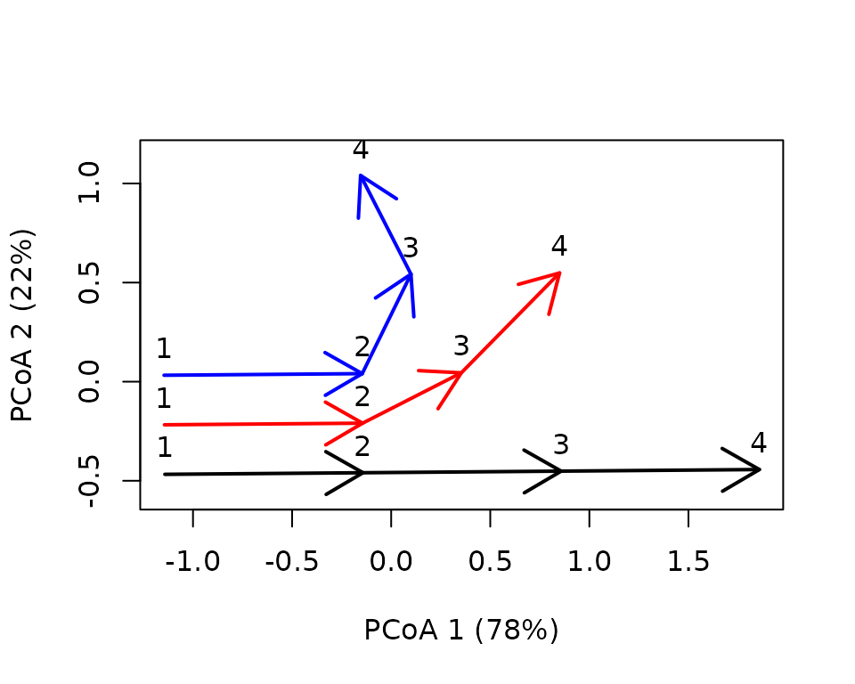
Let us assume we want to perform a global divergence test, but this
requires synchronous trajectories and these are not:

``` r

is.synchronous(x)
```

    ## [1] FALSE

The solution is to bring all trajectories to the same observation times.
In this case we choose the observation times of entity ‘3’ and this will
imply interpolation for entities ‘1’ and ‘2’:

``` r

x_inter <- interpolateTrajectories(x, times = c(1, 1.5, 2.0, 2.5))
```

The trajectory plot after interpolation looks like:

``` r

trajectoryPCoA(x_inter, 
               traj.colors = c("black","red", "blue"), time.labels = TRUE,
               lwd = 2)
legend("topright", col=c("black","red", "blue"), 
       legend=c("Trajectory 1", "Trajectory 2", "Trajectory 3"), bty="n", lty=1, lwd = 2)
```

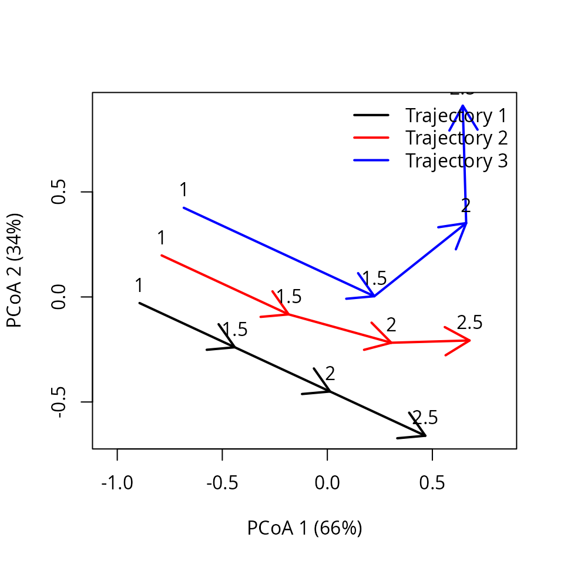

And now we can perform the global test for convergence/divergence:

``` r

trajectoryConvergence(x_inter, type="multiple")
```

    ## $tau
    ## tau 
    ##   1 
    ## 
    ## $p.value
    ## [1] 0.08333333

The test indicates divergence, although in a non significant way because
of the low sample size.

### 2.3 Interpolation effect

Interpolation has an effect on trajectory metrics, although this should
be small. In particular, it may inflate directionality. Let’s compare
trajectory metrics before:

``` r

trajectoryMetrics(x)
```

    ##   trajectory n t_start t_end duration   length mean_speed mean_angle
    ## 1          1 4       1  4.00     3.00 3.000000   1.000000    0.00000
    ## 2          2 4       1  3.25     2.25 2.266124   1.007166   22.50000
    ## 3          3 4       1  2.50     1.50 2.118034   1.412023   58.28253
    ##   directionality internal_ss internal_variance
    ## 1      1.0000000    5.000000         1.6666667
    ## 2      0.8274026    2.562500         0.8541667
    ## 3      0.5620859    1.609375         0.5364583

with after interpolation:

``` r

trajectoryMetrics(x_inter)
```

    ##   trajectory n t_start t_end duration   length mean_speed mean_angle
    ## 1          1 4       1   2.5      1.5 1.500000   1.000000    0.00000
    ## 2          2 4       1   2.5      1.5 1.546242   1.030828   13.28253
    ## 3          3 4       1   2.5      1.5 2.118034   1.412023   58.28253
    ##   directionality internal_ss internal_variance
    ## 1      1.0000000    1.250000         0.4166667
    ## 2      0.9063855    1.319444         0.4398148
    ## 3      0.5620859    1.609375         0.5364583

As expected, trajectory metrics of entity ‘3’ are unaffected. Length and
variance of entities ‘1’ and ‘2’ is obviously affected because the
trajectories have been trimmed. Interestingly, the directionality and
mean speed of entity ‘2’ have slightly increased.

### 2.4 Interpolation in a real example

In this example we analyze the dynamics of 8 permanent forest plots
located on slopes of a valley in the New Zealand Alps. The study area is
mountainous and centered on the Craigieburn Range (Southern Alps), South
Island, New Zealand (see map in Fig. 8 of De Cáceres et al. 2019).
Forests plots are almost monospecific, being the mountain beech
(*Fuscospora cliffortioides*) the main dominant tree species. Previously
forests consisted of largely mature stands, but some of them were
affected by different disturbances during the sampling period
(1972-2009) which includes 9 surveys. We begin our example by loading
the data set, which includes 72 plot observations:

``` r

data("avoca")
```

Before starting, we have to use function `vegdiststruct` from package
**vegclust** to calculate distances between forest plot states in terms
of structure and composition (see De Cáceres M, Legendre P, He F (2013)
Dissimilarity measurements and the size structure of ecological
communities. Methods Ecol Evol 4:1167–1177.
<https://doi.org/10.1111/2041-210X.12116>):

``` r

avoca_D_man <- vegclust::vegdiststruct(avoca_strat, method="manhattan", transform = function(x){log(x+1)})
```

Distances in `avoca_D_man` are calculated using the Manhattan metric. We
start ETA by defining our trajectories, which implies combining the
information about distances, sites and surveys:

``` r

years <- c(1971, 1974, 1978, 1983, 1987, 1993, 1999, 2004, 2009)
avoca_times <- years[avoca_surveys]
avoca_x <- defineTrajectories(avoca_D_man,  
                              sites = avoca_sites, 
                              times = avoca_times)
```

We use
[`trajectoryPCoA()`](https://emf-creaf.github.io/ecotraj/reference/trajectoryPlot.md)
to display the relations between forest plot states in this space and to
draw the trajectory of each plot:

``` r

oldpar <- par(mar=c(4,4,1,1))
trajectoryPCoA(avoca_x,
               traj.colors = RColorBrewer::brewer.pal(8,"Accent"), 
               axes=c(1,2), length=0.1, lwd=2)
legend("topright", bty="n", legend = 1:8, col = RColorBrewer::brewer.pal(8,"Accent"), lwd=2)
```

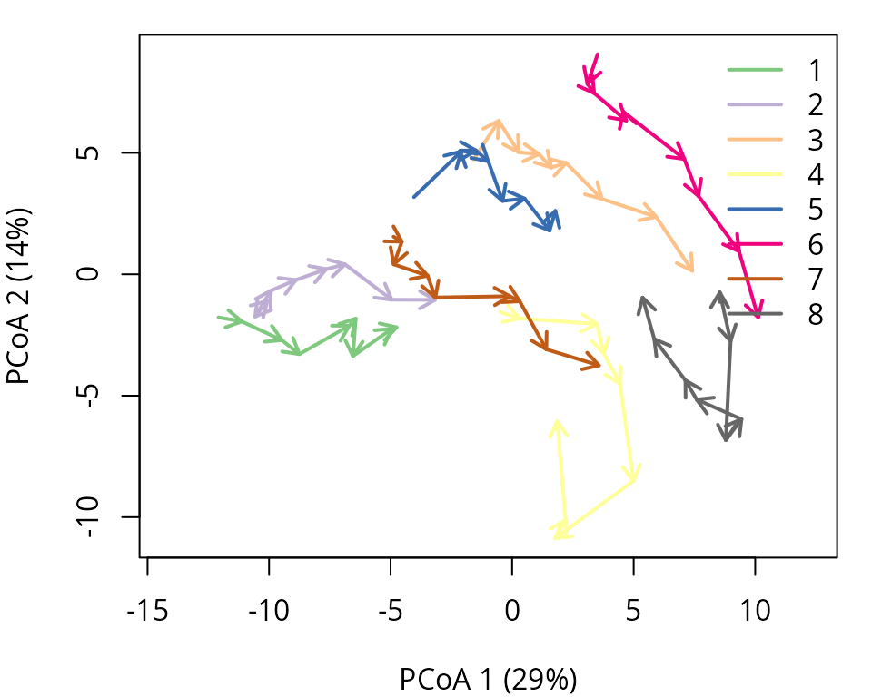

One use of interpolation is to force regular intervals in observations.
In the original definition the time difference between consecutive
surveys is between 3 and 6 years. Lets homogenize to 4 years:

``` r

years_regular <- seq(1971, 2009, by=4)
years_regular
```

    ##  [1] 1971 1975 1979 1983 1987 1991 1995 1999 2003 2007

We will loose 2009, but this will be closely represented by 2007. Lets
perform the interpolation:

``` r

avoca_x_inter <- interpolateTrajectories(avoca_x, years_regular)
```

We can see the effect on the trajectory plot, which should be small
(appart from the axis inversion):

``` r

oldpar <- par(mar=c(4,4,1,1))
trajectoryPCoA(avoca_x_inter,
               traj.colors = RColorBrewer::brewer.pal(8,"Accent"), 
               axes=c(1,2), length=0.1, lwd=2)
legend("topright", bty="n", legend = 1:8, col = RColorBrewer::brewer.pal(8,"Accent"), lwd=2)
```

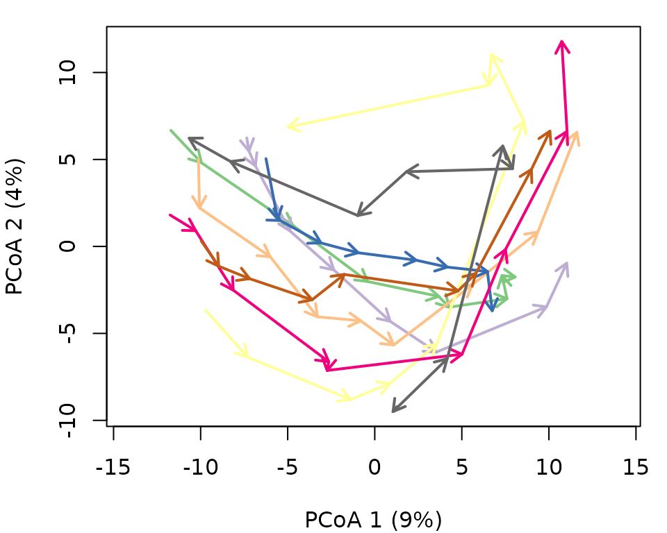

Let’s see the effect on the trajectory of forest plot ‘4’:

``` r

oldpar <- par(mfrow=c(1,2))
trajectoryPCoA(subsetTrajectories(avoca_x, "4"),
               length=0.1, lwd=2, time.labels = TRUE)
trajectoryPCoA(subsetTrajectories(avoca_x_inter, "4"),
               length=0.1, lwd=2, time.labels = TRUE)
```


``` r

par(oldpar)
```

## 3. Centering trajectories

### 3.1 What is trajectory centering?

Trajectory centering removes differences in (e.g. initial or overall)
*position* between trajectories, without changing their shape, to focus
on the direction of temporal changes. It is done using function
[`centerTrajectories()`](https://emf-creaf.github.io/ecotraj/reference/transformTrajectories.md).
Trajectory centering will normally imply subtracting the coordinate
values of the trajectory centroid from the states conforming each
trajectory. However, one may decide to “center” trajectories not with
respect to the overall centroid but to the average of a specific subset
of ecological states, or even a single state, for example the state
corresponding to the first or last observation. In this cases,
trajectories are shifted with respect to particular ecological states.
Trajectory centering is useful in cases where one wants to focus
trajectory analysis on temporal changes while discarding differences
between trajectories that are constant in time. It can also be useful
when trajectories are defined as subtrajectories of a trajectory with
cyclical patterns.

### 3.2 Simple centering example

We will employ the same simple example used in the introduction to
trajectory analysis. Let us first define the vectors that describe the
state of each entity (i.e. site):

``` r

entities = c("1","1","1","1","2","2","2","2","3","3","3","3")
```

We do not define `surveys`, so that they are assumed to be consecutive
for the each entity. However, we do define a matrix whose coordinates
correspond to the set of ecological states observed. We assume that the
ecosystem space $`\Omega`$ has two dimensions:

``` r

xy<-matrix(0, nrow=12, ncol=2)
xy[2,2]<-1
xy[3,2]<-2
xy[4,2]<-3
xy[5:6,2] <- xy[1:2,2]
xy[7,2]<-1.5
xy[8,2]<-2.0
xy[5:6,1] <- 0.25
xy[7,1]<-0.5
xy[8,1]<-1.0
xy[9:10,1] <- xy[5:6,1]+0.25
xy[11,1] <- 1.0
xy[12,1] <-1.5
xy[9:10,2] <- xy[5:6,2]
xy[11:12,2]<-c(1.25,1.0)
```

We define trajectories using:

``` r

D <- dist(xy)
x <- defineTrajectories(D, entities)
```

The trajectories can be displayed using a PCoA on the distance matrix as
follows:

``` r

trajectoryPCoA(x, traj.colors = c("green","red", "blue"), lwd = 2,
               survey.labels = T)
```

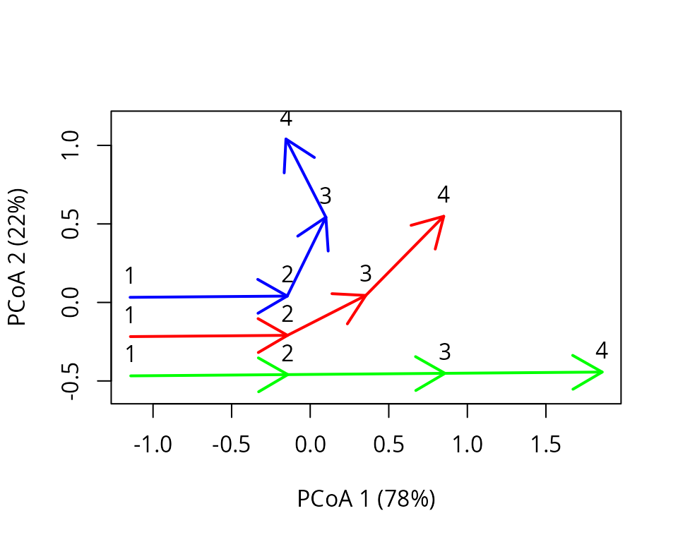

Centering trajectories is straightforward using function
[`centerTrajectories()`](https://emf-creaf.github.io/ecotraj/reference/transformTrajectories.md):

``` r

x_cent <- centerTrajectories(x)
```

The function will return an object of class `trajectories` where the
distance matrix has been modified to represent the distances after
centering. The effect of centering can be shown by repeating PCoA on the
modified object:

``` r

trajectoryPCoA(x_cent, traj.colors = c("green","red", "blue"), lwd = 2,
               survey.labels = T)
```

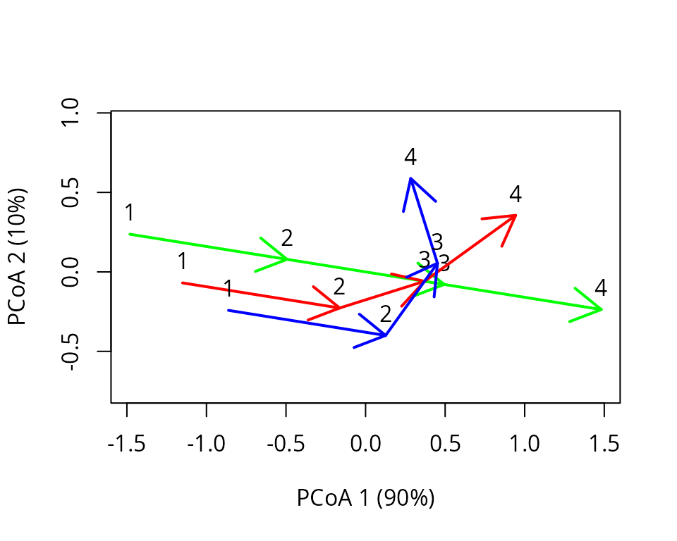

Function
[`centerTrajectories()`](https://emf-creaf.github.io/ecotraj/reference/transformTrajectories.md)
operates on distance matrices, so that we are free to use arbitrary
dissimilarity coefficients for resemblance between states. However, in
this case we could have conducted the centering manually by substracting
trajectory centroids. For that we build a matrix containing centroid
coordinates, which are repeated for all states of each trajectory:

``` r

m <- cbind(c(rep(mean(xy[1:4,1]),4), rep(mean(xy[5:8,1]),4), rep(mean(xy[9:12,1]),4)),
                   c(rep(mean(xy[1:4,2]),4), rep(mean(xy[5:8,2]),4), rep(mean(xy[9:12,2]),4)))
m
```

    ##        [,1]   [,2]
    ##  [1,] 0.000 1.5000
    ##  [2,] 0.000 1.5000
    ##  [3,] 0.000 1.5000
    ##  [4,] 0.000 1.5000
    ##  [5,] 0.500 1.1250
    ##  [6,] 0.500 1.1250
    ##  [7,] 0.500 1.1250
    ##  [8,] 0.500 1.1250
    ##  [9,] 0.875 0.8125
    ## [10,] 0.875 0.8125
    ## [11,] 0.875 0.8125
    ## [12,] 0.875 0.8125

Centering operation is equal to the subtraction:

``` r

xy_cent <- (xy - m)
xy_cent
```

    ##         [,1]    [,2]
    ##  [1,]  0.000 -1.5000
    ##  [2,]  0.000 -0.5000
    ##  [3,]  0.000  0.5000
    ##  [4,]  0.000  1.5000
    ##  [5,] -0.250 -1.1250
    ##  [6,] -0.250 -0.1250
    ##  [7,]  0.000  0.3750
    ##  [8,]  0.500  0.8750
    ##  [9,] -0.375 -0.8125
    ## [10,] -0.375  0.1875
    ## [11,]  0.125  0.4375
    ## [12,]  0.625  0.1875

We can compare the equivalence of the two approaches using:

``` r

max(as.vector(x_cent$d) - as.vector(dist(xy_cent)))
```

    ## [1] 4.996004e-16

### 3.3 Centering effect

Trajectory centering does not modify the properties of individual
trajectories, as can be seen by comparing trajectory metrics before:

``` r

trajectoryMetrics(x)
```

    ##   trajectory n t_start t_end duration   length mean_speed mean_angle
    ## 1          1 4       1     4        3 3.000000  1.0000000    0.00000
    ## 2          2 4       1     4        3 2.266124  0.7553746   22.50000
    ## 3          3 4       1     4        3 2.118034  0.7060113   58.28253
    ##   directionality internal_ss internal_variance
    ## 1      1.0000000    5.000000         1.6666667
    ## 2      0.8274026    2.562500         0.8541667
    ## 3      0.5620859    1.609375         0.5364583

with the same metrics after centering:

``` r

trajectoryMetrics(x_cent)
```

    ##   trajectory n t_start t_end duration   length mean_speed mean_angle
    ## 1          1 4       1     4        3 3.000000  1.0000000    0.00000
    ## 2          2 4       1     4        3 2.266124  0.7553746   22.50000
    ## 3          3 4       1     4        3 2.118034  0.7060113   58.28253
    ##   directionality internal_ss internal_variance
    ## 1      1.0000000    5.000000         1.6666667
    ## 2      0.8274026    2.562500         0.8541667
    ## 3      0.5620859    1.609375         0.5364583

However, centering will modify the results of metrics that compare
trajectories, such as convergence/divergence or trajectory
dissimilarities. Generally speaking, trajectory convergence should be
studied without centering, whereas calculating trajectory dissimilarity
after centering may be interesting to remove differences that are
constant in time.

### 3.4 Trajectory centering excluding observations

As explained in the introduction, centering can be performed with
respect to different states beyond the trajectory centroid. Say we want
to align the first segment of the three trajectories to focus on the
changes that occur later. To do so, first define ecological states that
are to be *excluded* from the computation of the trajectory position
taken as reference (its center). In our case these are the states of
trajectories that were surveyed later than the first segment (i.e. the
third and fourth observations of each trajectory):

``` r

excluded <- c(3:4,7:8,11:12)
```

Then we can call again
[`centerTrajectories()`](https://emf-creaf.github.io/ecotraj/reference/transformTrajectories.md),
but supplying the vector we created to parameter `exclude`:

``` r

x_cent_excluded <- centerTrajectories(x, exclude = excluded)
```

We can see the effect of the new centering using:

``` r

trajectoryPCoA(x_cent_excluded, traj.colors = c("green","red", "blue"), lwd = 2,
               survey.labels = T)
```

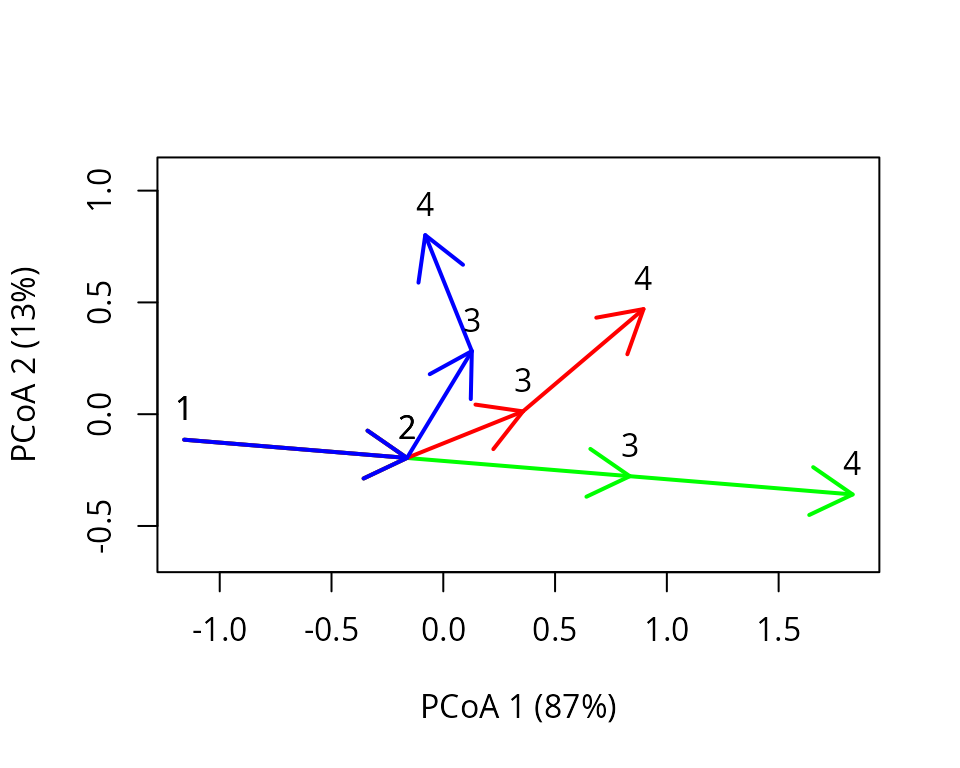

As before, we could check the equivalence with a centering using
explicit coordinates, but this is not needed at this stage.

### 3.5 Centering in a real example

Let us examine the effect of centering on the forest plot data. As
before we use
[`trajectoryPCoA()`](https://emf-creaf.github.io/ecotraj/reference/trajectoryPlot.md)
to display the relations between forest plot states in this space and to
draw the trajectory of each plot before and after centering:

``` r

oldpar <- par(mar=c(4,4,1,1), mfrow=c(1,2))
trajectoryPCoA(avoca_x,
               traj.colors = RColorBrewer::brewer.pal(8,"Accent"), 
               axes=c(1,2), length=0.1, lwd=2)
title("Before centering")
trajectoryPCoA(centerTrajectories(avoca_x),
               traj.colors = RColorBrewer::brewer.pal(8,"Accent"), 
               axes=c(1,2), length=0.1, lwd=2)
title("After centering")
```

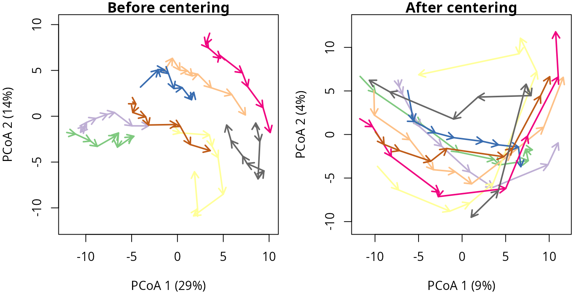

``` r

par(oldpar)
```

Finally, we can illustrate the effect of centering with respect to the
initial or final states. To do so we define vectors that exclude the
remaining states from centering:

``` r

all_but_first <- 9:length(avoca_sites)
all_but_last <- 1:(length(avoca_sites)-8)
```

Then we conduct the two centerings:

``` r

avoca_cent_initial <- centerTrajectories(avoca_x, 
                                         exclude = all_but_first) 
avoca_cent_final <- centerTrajectories(avoca_x, 
                                       exclude = all_but_last) 
```

We can compare their effect using:

``` r

oldpar <- par(mar=c(4,4,1,1), mfrow=c(1,2))
trajectoryPCoA(avoca_cent_initial,
               traj.colors = RColorBrewer::brewer.pal(8,"Accent"), 
               axes=c(1,2), length=0.1, lwd=2)
title("Reference: initial state")
trajectoryPCoA(avoca_cent_final,
               traj.colors = RColorBrewer::brewer.pal(8,"Accent"), 
               axes=c(1,2), length=0.1, lwd=2)
title("Reference: final state")
```

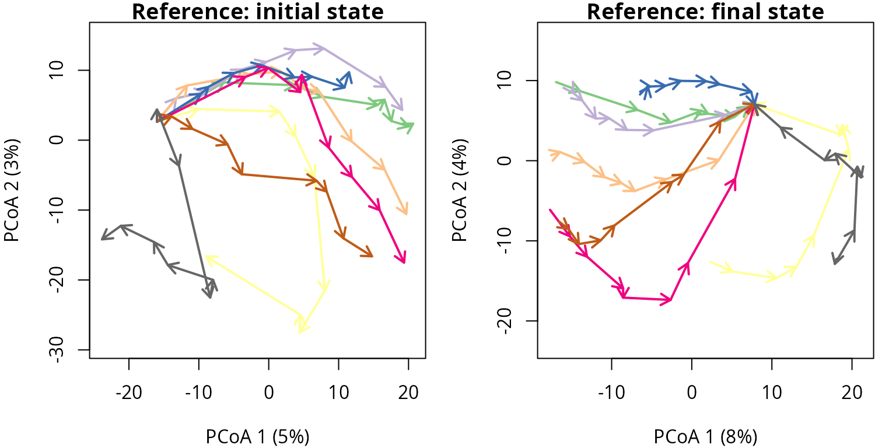

``` r

par(oldpar)
```

## 4 Smoothing trajectories

### 4.1 What is trajectory smoothing?

Trajectories may contain variation that is considered *noise*, for
whatever reason (e.g. measurement error). Similarly to univariate
smoothing of temporal series, noise can be smoothed out in trajectory
data. This is done applying a multivariate moving average over the
trajectory, using a kernel to specify average weights. This is done
using function
[`smoothTrajectories()`](https://emf-creaf.github.io/ecotraj/reference/transformTrajectories.md).

### 4.2 Smoothing kernel

Function
[`smoothTrajectories()`](https://emf-creaf.github.io/ecotraj/reference/transformTrajectories.md)
smoothes out noise from trajectories by applying a Gaussian kernel over
each trajectory:
``` math
\begin{equation}
K(x, x_r) = exp\left( - \frac{(x - x_r)^2}{2\cdot b^2} \right)
\end{equation}
```
where $`x`$ is the survey time of the target location, $`x_r`$ is the
survey time of one the original points and $`b`$ is the kernel scale.
Kernel values are normalized to one and they are used to determine
(implicitly) the new coordinates of ecological states. The kernel
application turns consecutive ecological states more similar.

### 4.3 Smoothing effect

Function
[`smoothTrajectories()`](https://emf-creaf.github.io/ecotraj/reference/transformTrajectories.md)
performs the smoothing operation and returns a modified distance matrix
describing distances between ecological states:

``` r

avoca_x_smooth <- smoothTrajectories(avoca_x)
```

The following trajectory plot illustrates the effect of smoothing:

``` r

oldpar <- par(mar=c(4,4,1,1), mfrow=c(1,2))
trajectoryPCoA(avoca_x,
               traj.colors = RColorBrewer::brewer.pal(8,"Accent"), 
               axes=c(1,2), length=0.1, lwd=2)
title("Before smoothing")
trajectoryPCoA(avoca_x_smooth,
               traj.colors = RColorBrewer::brewer.pal(8,"Accent"), 
               axes=c(1,2), length=0.1, lwd=2)
title("After smoothing")
```

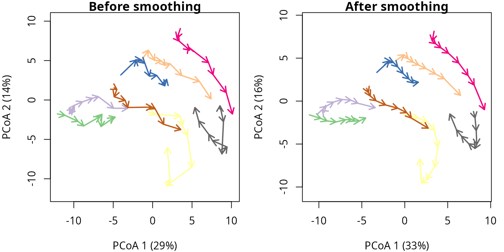

``` r

par(oldpar)
```

Trajectory smoothing logically alters several trajectory metrics. This
can be checked by first evaluating multiple metrics:

``` r

trajectoryMetrics(avoca_x)
```

    ##   trajectory n t_start t_end duration    length mean_speed mean_angle
    ## 1          1 9    1971  2009       38 10.336602  0.2720158   78.82477
    ## 2          2 9    1971  2009       38  8.848673  0.2328598   17.61550
    ## 3          3 9    1971  2009       38  8.272077  0.2176862   37.39925
    ## 4          4 9    1971  2009       38 14.124698  0.3717026   36.44717
    ## 5          5 9    1971  2009       38  7.558909  0.1989187   57.89321
    ## 6          6 9    1971  2009       38 10.777816  0.2836267   34.34150
    ## 7          7 9    1971  2009       38  8.113223  0.2135059   49.96352
    ## 8          8 9    1971  2009       38 10.681940  0.2811037   66.68343
    ##   directionality internal_ss internal_variance
    ## 1      0.6781369    46.25129          5.781411
    ## 2      0.6736490    46.87255          5.859068
    ## 3      0.8651467    43.86684          5.483355
    ## 4      0.5122482    68.61063          8.576329
    ## 5      0.6677116    28.49495          3.561869
    ## 6      0.7058465    64.08320          8.010400
    ## 7      0.7391775    41.30863          5.163579
    ## 8      0.5254225    48.97523          6.121903

And re-evaluating them after smoothing:

``` r

trajectoryMetrics(avoca_x_smooth)
```

    ##   trajectory n t_start t_end duration    length mean_speed mean_angle
    ## 1          1 9    1971  2009       38  6.776356  0.1783252   26.24172
    ## 2          2 9    1971  2009       38  7.601166  0.2000307   22.07862
    ## 3          3 9    1971  2009       38  6.792566  0.1787517   15.00878
    ## 4          4 9    1971  2009       38 11.049763  0.2907832   36.24248
    ## 5          5 9    1971  2009       38  5.741160  0.1510831   22.42376
    ## 6          6 9    1971  2009       38  8.884752  0.2338093   11.53945
    ## 7          7 9    1971  2009       38  6.351899  0.1671552   21.50039
    ## 8          8 9    1971  2009       38  7.884819  0.2074952   16.86362
    ##   directionality internal_ss internal_variance
    ## 1      0.8043023    34.73916          4.342394
    ## 2      0.7034985    36.40341          4.550427
    ## 3      0.9107370    34.04812          4.256015
    ## 4      0.5753210    51.04204          6.380255
    ## 5      0.7545522    22.31258          2.789073
    ## 6      0.7586568    49.12458          6.140572
    ## 7      0.8084251    32.26089          4.032611
    ## 8      0.6322645    35.37317          4.421646

In particular, overall trajectory length, speed and internal variability
are reduced while trajectory directionality is increased. Whether these
effects are desirable or not, will depend on the application, but
generally speaking smoothing should only be used to clarify trajectory
paths visually.

## 5 Averaging trajectories

### 5.1 What is trajectory averaging?

One may be interested in the properties of a trajectory that summarizes
the dynamics of a given set of entities. Trajectory averaging involves
the definition of a new trajectory whose states are multivariate means
of the corresponding observations in a set of target entities. Average
trajectories can only be calculated if the input trajectories are
**synchronous** (see function
[`is.synchronous()`](https://emf-creaf.github.io/ecotraj/reference/is.synchronous.md)),
because the observations to be averaged must exist for all the target
entities. The average trajectory is added to the output object of class
`trajectories`, which can also include the original trajectories that
were averaged as well as other trajectories that are left unchanged.

### 5.2 Simple averaging example

Again, we will employ the same simple example used in the introduction
to trajectory analysis. Let us first define the vectors that describe
the state of each entity (i.e. site):

``` r

entities = c("1","1","1","1","2","2","2","2","3","3","3","3")
```

We do not define `surveys`, so that they are assumed to be consecutive
for the each entity. However, we do define a matrix whose coordinates
correspond to the set of ecological states observed. We assume that the
ecosystem space $`\Omega`$ has two dimensions:

``` r

xy<-matrix(0, nrow=12, ncol=2)
xy[2,2]<-1
xy[3,2]<-2
xy[4,2]<-3
xy[5:6,2] <- xy[1:2,2]
xy[7,2]<-1.5
xy[8,2]<-2.0
xy[5:6,1] <- 0.25
xy[7,1]<-0.5
xy[8,1]<-1.0
xy[9:10,1] <- xy[5:6,1]+0.25
xy[11,1] <- 1.0
xy[12,1] <-1.5
xy[9:10,2] <- xy[5:6,2]
xy[11:12,2]<-c(1.25,1.0)
```

We define trajectories using:

``` r

D <- dist(xy)
x <- defineTrajectories(D, entities)
```

The trajectories can be displayed using a PCoA on the distance matrix as
follows:

``` r

oldpar <- par(mar=c(4,4,1,1))
trajectoryPCoA(x, traj.colors = c("green","red", "blue"), lwd = 2,
               survey.labels = T)
```

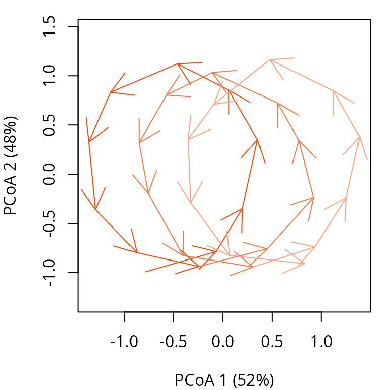

``` r

par(oldpar)
```

Averaging trajectories is straightforward using function
[`averageTrajectories()`](https://emf-creaf.github.io/ecotraj/reference/transformTrajectories.md):

``` r

x_ave <- averageTrajectories(x)
```

By default the function will return an object of class `trajectories`
containing only one trajectory, corresponding to the average:

``` r

x_ave
```

    ## $d
    ##           1         2         3
    ## 2 1.0000000                    
    ## 3 1.6029487 0.6346478          
    ## 4 2.0833333 1.1577037 0.5335937
    ## 
    ## $metadata
    ##     sites surveys times
    ## 1 average       1     1
    ## 2 average       2     2
    ## 3 average       3     3
    ## 4 average       4     4
    ## 
    ## attr(,"class")
    ## [1] "trajectories" "list"

The effect of averaging can be shown by repeating PCoA on the modified
object:

``` r

oldpar <- par(mar=c(4,4,1,1))
trajectoryPCoA(x_ave, lwd = 2, survey.labels = TRUE)
```


``` r

par(oldpar)
```

We can choose to keep the original trajectories along with the
trajectory average, by using `keep_members`:

``` r

x_ave_members <- averageTrajectories(x, keep_members = TRUE)
```

In the following plot we use gray color to identify the original
trajectories, and black for the average trajectory:

``` r

oldpar <- par(mar=c(4,4,1,1))
trajectoryPCoA(x_ave_members, traj.colors = c("gray","gray", "gray", "black"), lwd = 2,
               survey.labels = TRUE)
```

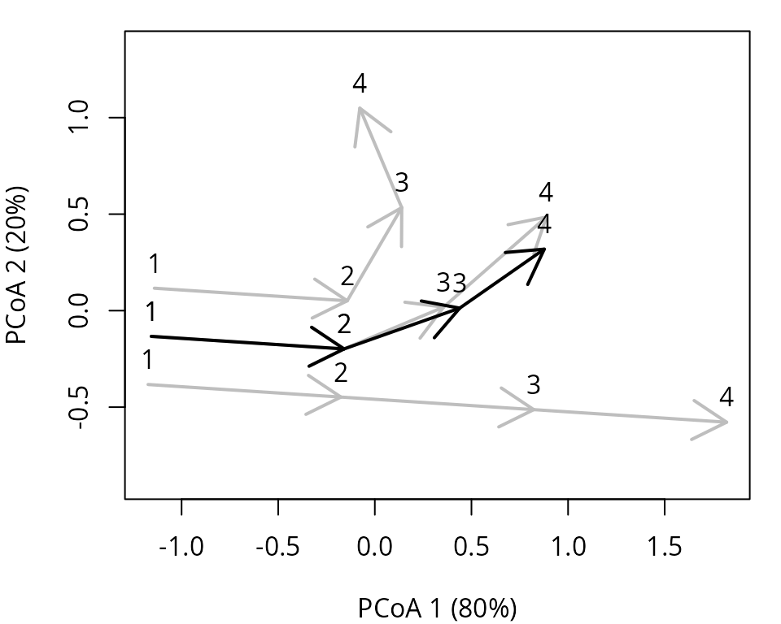

``` r

par(oldpar)
```

It is also possible to average a subset of the original trajectories,
while keeping the remaining unaltered. For example, we average here the
trajectories of sites `"2"` and `"3"`:

``` r

oldpar <- par(mar=c(4,4,1,1))
trajectoryPCoA(averageTrajectories(x, group = c("2", "3"), keep_members = TRUE), 
               traj.colors = c("green","gray", "gray", "black"), lwd = 2,
               survey.labels = TRUE)
```

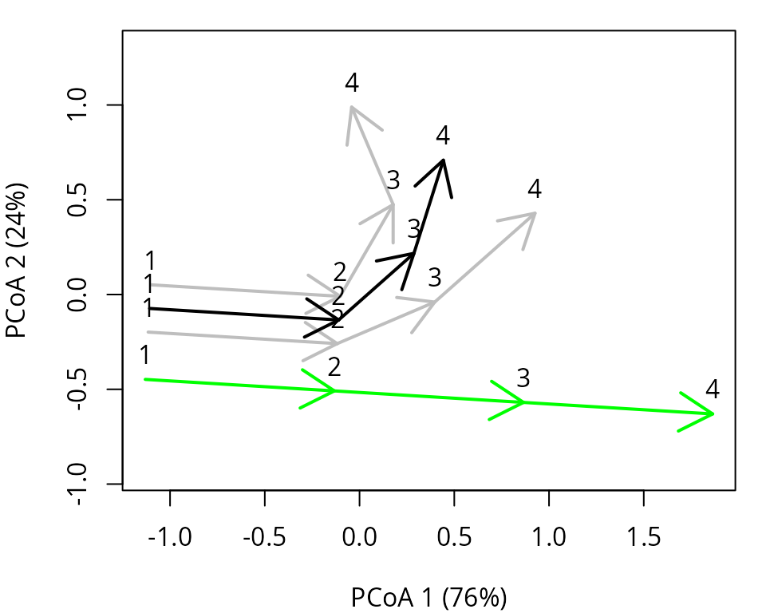

``` r

par(oldpar)
```

Or sites `"1"` and `"2"`:

``` r

oldpar <- par(mar=c(4,4,1,1))
trajectoryPCoA(averageTrajectories(x, group = c("1", "2"), keep_members = TRUE), 
               traj.colors = c("gray","gray", "blue", "black"), lwd = 2,
               survey.labels = TRUE)
```

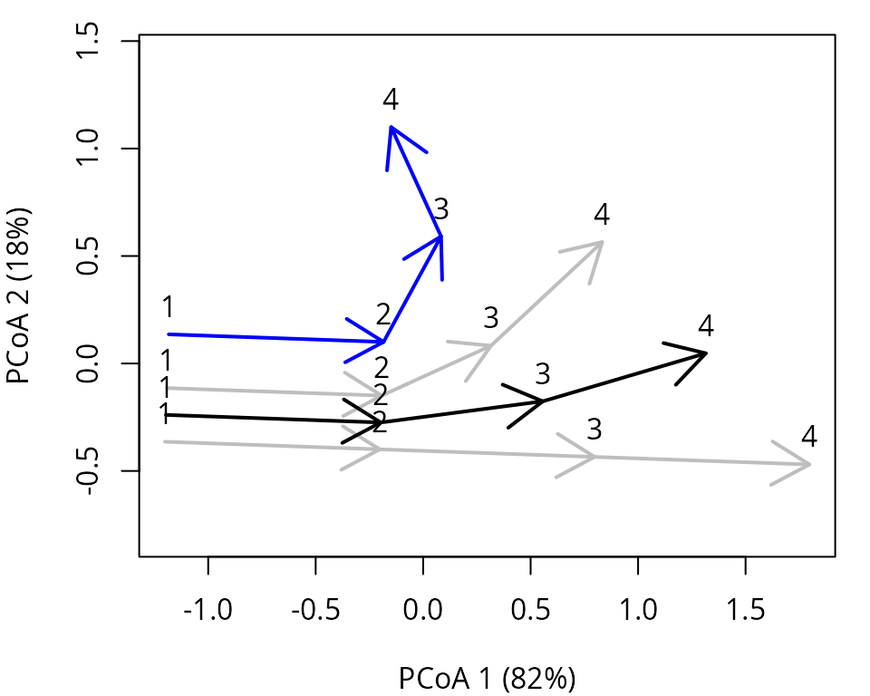

``` r

par(oldpar)
```

### 5.3 Averaging in a real example

Let’s take again the forest plot data:

``` r

oldpar <- par(mar=c(4,4,1,1))
trajectoryPCoA(avoca_x,
               traj.colors = RColorBrewer::brewer.pal(8,"Accent"), 
               axes=c(1,2), length=0.1, lwd=2)
legend("topright", bty="n", legend = 1:8, col = RColorBrewer::brewer.pal(8,"Accent"), lwd=2)
```


``` r

par(oldpar)
```

We can first have the question of whether we could group the eight plots
into a lower number of dynamic entities. For that we first calculate
trajectory distances:

``` r

avoca_D <- trajectoryDistances(avoca_x, distance.type = "TSPD")
```

And we use PCoA to display dynamic relationships:

``` r

oldpar <- par(mar=c(4,4,1,1))
mMDS <- smacof::mds(avoca_D)
mMDS
```

    ## 
    ## Call:
    ## smacof::mds(delta = avoca_D)
    ## 
    ## Model: Symmetric SMACOF 
    ## Number of objects: 8 
    ## Stress-1 value: 0.092 
    ## Number of iterations: 16

``` r

xret <- mMDS$conf
plot(xret, xlab="axis 1", ylab = "axis 2", asp=1, pch=21,
     bg=RColorBrewer::brewer.pal(8,"Accent"), 
     xlim=c(-1.0,1), ylim=c(-1,1.0))
text(xret, labels=1:8, pos=1)
```

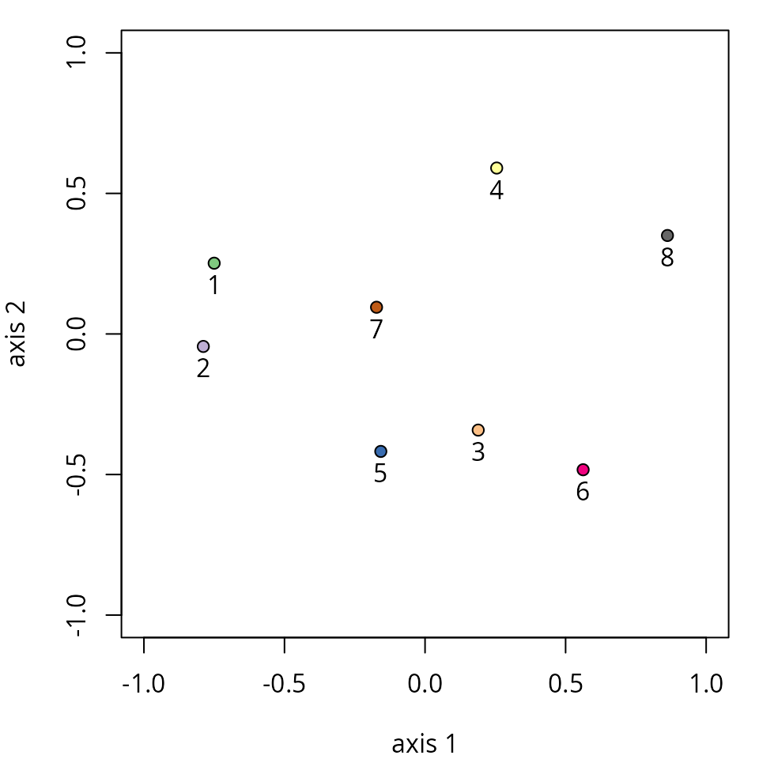

``` r

par(oldpar)
```

At this point, we may decide to average the three groups of forest
plots:

``` r

g1 <- c("1", "2", "7")
g2 <- c("5", "3","6")
g3 <- c("4", "8") 
```

The following code sequentially replaces each group of trajectories by
its corresponding average trajectory (we use parameter `output_name` to
provide a different name to each average):

``` r

avoca_groups <- averageTrajectories(avoca_x, group = g1, output_name = "group 1")
avoca_groups <- averageTrajectories(avoca_groups, group = g2, output_name = "group 2")
avoca_groups <- averageTrajectories(avoca_groups, group = g3, output_name = "group 3")
```

We finish by displaying the three average trajectories:

``` r

oldpar <- par(mar=c(4,4,1,1))
trajectoryPCoA(avoca_groups,
               traj.colors = RColorBrewer::brewer.pal(3,"Accent"), 
               axes=c(1,2), length=0.1, lwd=2)
legend("topright", bty="n", legend = paste("group", 1:3), 
       col = RColorBrewer::brewer.pal(3,"Accent"), lwd=2)
```

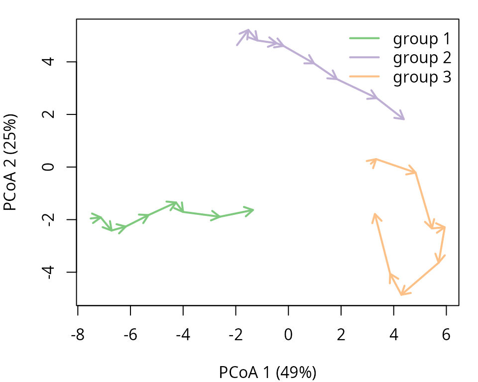

``` r

par(oldpar)
```
